# Milestone Project 2 - Fast Project Scheduling

## Table of Contents

[[toc]]

## 1.0 Introduction

### 1.1 Why The Project?

As a project manager I have on many occasions been set the challenge of generating a high level project schedule for the development of a new product or an enhancement to an existing product. Often I am asked to consider more than one option and to consider the risks associated with each option.  Somehow such requests usually come about a few days before the next project board meeting. While the resulting project schedule(s) appear simple, the effort required to generate such high level project plans can be significant and disruptive to the project team. This need not be the case if an appropriate planning tool could be used. While there are many project planning tools available that can meet this challenge, they are often complex to use and require significant initial set up.

My proposed browser based planning tool overcomes many of these problems by providing a simple interactive user interface that focuses on the need to produce project timeline together with a project risks profile and does away with the need for a complex initial setup.  

### 1.2 Some Project Planning Basics

While agile project management methodologies are used by virtually every organisation involved in development work, they are of little use when preparing an initial project schedule for the project board. The project board will want to know, how long the project will take to complete, what options have been considered and have the associated risks been taken into consideration when deriving the timeline. Project costs can usually be determined at least at a high level from the schedule. This is top-down project planning. Bottom-up project planning which requires a more detailed look at the work break down into tasks, task durations and risks becomes important at a later stage. 

It has been common practice to estimate the duration of project stages or tasks using a 3 point estimate:

- Best Case:  where it is assumed that nothing goes wrong.

- Worst Case: where everything that will go wrong does go wrong.

- Most Likely Case: somewhere between the Best Case and Worst Case estimates based on the project team's past experience.

Assuming that each task has a finish to start relationship with the next task, then the project completion date is given by summing either the best case durations, the most likely case durations or the worst case durations.

Summing the Best Case durations means that risks have not been factored in and therefore this is not a reflection of how long the project will take to complete. Summing all the Worst Case durations means that all the risks will mature. This again is unlikely to turn out to be true. Summing the Most Likely Case durations means that some risks have been considered, but not all.

The actual duration of the project will lie somewhere between the sum of the Best Case duration estimates and the sum  of the Worst Case duration estimates with a bias towards the sum of the Most Likely Case estimates. This provides us with a wide range of possible project completion dates with the shortest date having a low probability of being achieved and the longest date a high probability of being achieved. While it is dangerous to assume that no project risks will mature, it is also sensible to assume that every project risk will mature. We therefore have a risk profile with 0% probability of achieving the Best Case project completion date and 100% probability of the completing the project by the Worst Case date. It is then up to the project board to decide not only which project option to choose, but also the delivery date dependant on their risk appetite. For example, some project boards may decide that planning on an earlier completion date with a 50% probability is acceptable, while other project boards may decide that a 70% probability is required with the associated later project completion date. How this risk profile is generated is discussed in the next section.

### 1.3 Monte Carlo Simulation

A [Monte Carlo simulation](https://en.wikipedia.org/wiki/Monte_Carlo_method) can be used to create a statistical model of the impact of risk on the project and may be used to determine not only the likely finish date for the project, but also the associated probability of doing so.

For project scheduling application Monte Carlo simulations involves a process of selecting a random (in the next section we will talk more about what random means) duration task or project stage duration between the Best Case estimate and the Worst Case estimate for each task and summing together. By iterating through this process many times we end up with a range of project durations outcomes. The probability of achieving a given project duration is given by the fraction of times the project duration was achieved out of all the times that the processes was iterated. In essence, it is as if we were running the project many times and looking to see how many times a given project duration was achieved. Key to a successful Monte Carlo simulation is choosing the right random number probability distribution.  

### 1.4 Random Numbers and All That

Most programming languages include a function to generate a random number, either in the range 0 -1 or some other numerical range. Javascript is no exception, however as with other programming languages Javascript generates random numbers with a linear probability of occurrence. For example, the probability of the random() function generating 0.9 as the next number is the same as generating 0.7. Unfortunately project task durations do not follow a linear distribution. The probability of a project task requiring the worst case duration is in reality lower than the probability of the task requiring the most likely time to complete. When selecting a random task duration between the best case and worst case for our Monte Carlo simulation we need to take this into consideration. Fortunately this has all been taken care of by the [PERT probability distribution](https://en.wikipedia.org/wiki/PERT_distribution).

While the PERT distribution is not native to Javascript or JQuery, it is relatively simple to generate a random number with a [triangular probability distribution](https://en.wikipedia.org/wiki/Triangular_distribution). Although not ideal, for the purpose of this project the triangular probability distribution will be sufficient.

## 2.0 UX

### 2.1 User Stories

The following section presents User Stories along with further detailed requirements which will subsequently be tested.

**2.1.1 As a project manager, I want an online high level project planning tool so that I can rapidly assemble a project schedule and a risk profile.**

- 2.1.1.1 The project planning tool will require only one web browser page to render.

- 2.1.1.2 A task entry table is required for the entry of project task best case, most likely case and worst case durations, for task descriptions and for the entry of an initial project start date.

- 2.1.1.3 Saturdays and Sundays are required as the default non project days.

- 2.1.1.4 The number of required simulation runs will be set to 500 on initialisation.

- 2.1.1.5 A project timeline plot is required to provide a visual representation of the task data entered.

- 2.1.1.6 A plot is required to provide the risk profile associated with completing the project at a given date.

**2.1.2 As a user, I want information to be presented intuitively and lead me through the inherent project planning process.**

- 2.1.2.1 The user will be provided with positive response when hovering above an available button

- 2.1.2.2 Buttons that cannot be used will be greyed out until such time as they can be used.

- 2.1.2.3 The timeline plot and risk profile plot will only be displayed when there is sufficient task data to create them.

- 2.1.2.4 An alert will be displayed when an error is detected in the task entry table.

- 2.1.2.5 The timeline plot and project risk profile plot will not be generated or updated if an error is detected in the task entry table.

- 2.1.2.6 A new table row will be made available without the need to actively confirm the current row.

- 2.1.2.7 A new task row will not become available until the task data in the present row has been correctly entered.

- 2.1.2.8 Task data may be entered in any order.

- 2.1.2.9 Error check of a new task entry row will be undertaken after the worst case task duration has been entered

- 2.1.2.10 There will be no restriction on the number of tasks that may be entered.

**2.1.3 As a project manager, I want the project planning tool to determine the Best Case, Most Likely Case and Worst Case task completion dates based on a start date and on a number of days in the week allocated to the project so that I can quickly derive a project plan.**

- 2.1.3.1 The Best Case, Most Likely Case and Worst Case task finish dates will be determined using the start date and the week days allocated to the project.

- 2.1.3.2 The initial project start date may be set to a past date, the present date or a future date.

**2.1.4 As a project manager, I want to be able to add tasks to the project plan, make changes to the start date, task durations and week days available to the project and correct errors, so that I can investigate "what if scenarios".**

- 2.1.4.1 The tasks in the task entry table may be changed after an initial timeline plot and risk profile plot have been generated.

- 2.1.4.2 Tasks may be added to the task entry table after an initial timeline plot and risk profile plot have been generated by clicking on the start button. 

**2.1.5 As a project manager, I want to be able to set the number of project days / non project days allocated to the project as a means of controlling resource availability.**

- 2.1.5.1 The tasks completion dates associated with the best case, most likely case and worst task durations will automatically be re calculated whenever the non project days is changed.  

**2.1.6 As a project manager, I want a project planning tool to be provide me with a timeline plot showing the overall duration of the project in a  familiar form that the project board may use to validate the project.**

- 2.1.6.1 The timeline plot will display a single bar for each task showing the best case, most likely case and worst case task completion date.

- 2.1.6.2 The timeline plot is updated whenever the start button is clicked and will display any changes made to the task entry table or the non selected project days.

**2.1.7 As a project manager, I want a project planning tool that will provide me with a risk profile plot showing the risk associated with completing the project on a given date, so that I and the project board may make a validated risk based decision on the project completion date.**

- 2.1.7.1 The risk profile plot will update when ever the start button is clicked and will respond to changes made to the task entry table, the non project days selected and the number of simulation runs selected.

**2.1.8 As a user, I want to be provided with HELP in getting started and operating the tool.**

- 2.1.8.1 Help to enter task data will be available on request at any time.

- 2.1.8.2 Help to interpret charts will be available on request at any time

**2.1.9 As a user, I want to select the number of simulation runs so that I can trade off between speed of execution and accuracy.**

- 2.1.9.1 The risk profile chart will respond to the number of simulation runs selected by the user.

**2.1.10 As a user, I want a project planning tool with a high degree of interactive error checking so that any typographical errors that they may be quickly resolved.**

- 2.1.10.1 The user must enter a task description.

- 2.1.10.2 The task description must start with an alphanumeric character. Subsequent non alphanumeric characters are permitted

- 2.1.10.3 Negative value task duration values are not permitted.

- 2.1.10.4 Task duration values must be whole days. Fractions of a project day are not permitted.

- 2.1.10.5 Task duration values must be greater than 1.

- 2.1.10.6 The following condition must be met:  Best Case Duration < Most Likely Case Duration < Worst Case Duration.

- 2.1.10.7 If every day of the week is selected as a non project day, then Monday will automatically become the only project day. The user will receive an error alert

- 2.1.10.8 The start date for the first project task must be within +/-10 years of the present date.

### 2.2 Strategy

The purpose of this web site is to provide project managers with a high level project scheduling tool that encompasses risk management again at a high level. This project scheduling tool is not intended to be used for day to day planning activities. It is intended that this project scheduling tool should be simple and intuitive to use.

### 2.3 Structure

This project consists of a single web page.

Discrete buttons are used to allow the user to select options or initiate actions. In some cases such as the selection of non project days or the number of simulation runs, the use of radio buttons was considered, but discounted as they did not provide the desired visual impact.

Not every component of the HTML page is rendered on loading. As will be discussed later on, only those components that the user uses or provides useful information is rendered.

### 2.4 (Surface) Wireframes

This web page tool may be considered in terms of 3 distinct sections with the addition of 2 modal windows.

1. Section 1 Top left - provides a task entry table together with a **Submit** button and a **Reset** button.

2. Section 2 Top right - provides buttons for selecting non project days, the number of simulation runs and a help button.

3. Section 3 Middle - provides a timeline for the tasks entered by the user and a project risk chart.

4. The **Help** modal is rendered when help button is clicked and hidden when the top right close button is clicked.

5. The **Alert** modal is rendered when ever the programme detects an error in the entry of task data via the Task Entry Table. The **Alert** modal window is closed when the top right close button is clicked on.

On first loading, the page will be rendered as follows:

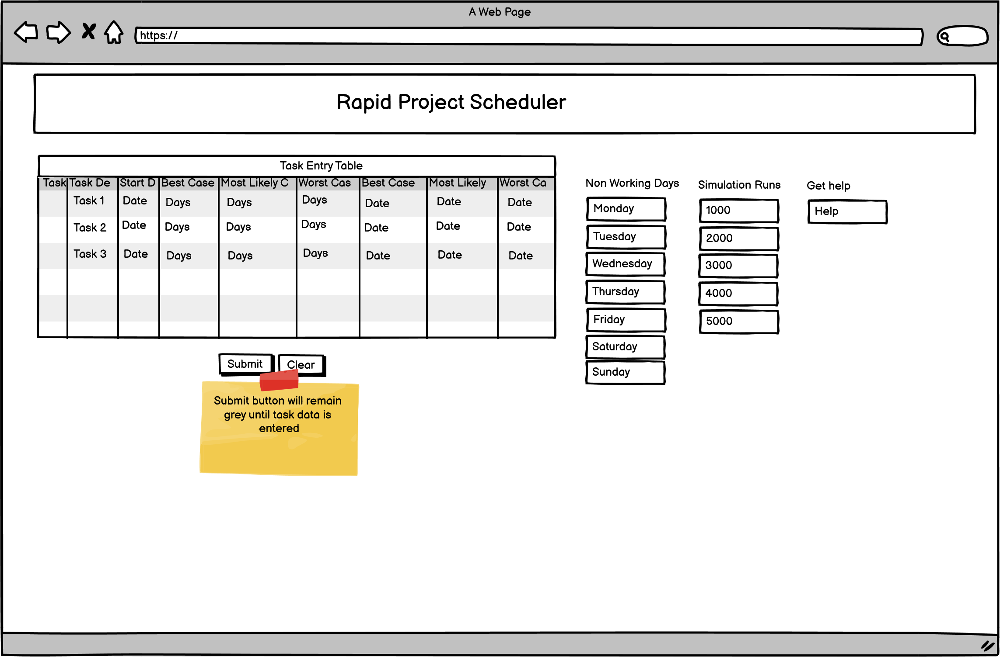{width=80%}
*fig: Fullscreen width at 1206px*

The plots will not be rendered until task data has been entered and the submit button clicked.

Clicking on the **Help** button will render the help modal. This will provide the user with instructions on how to use the Rapid Project Scheduler and how to interpret the charts.

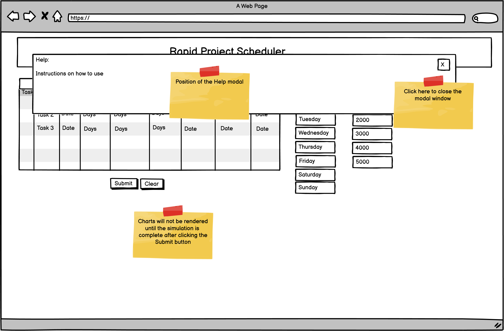{width=80%}
*fig: Fullscreen width at 1206px with help modal*

If an error is detected in the entry of task data via the **Task Entry Table** then an alert modal window is rendered. 

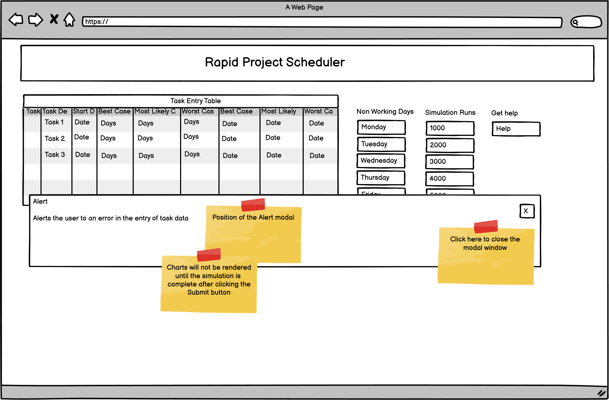{width=80%}
*fig: Fullscreen width at 1206px with alert modal*

The Alert and Help modal windows are rendered at the different screen widths supported by this project. 

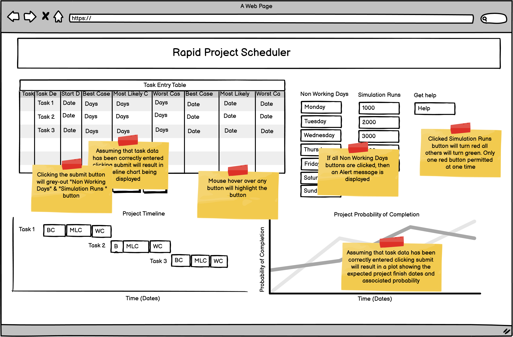{width=80%}
*fig: Full screen width at 1206px with charts*

The web page will render correctly to provide a readable display at 1206px, 768px and 320px screen widths. The wireframes below show the contents of the web page without either the alert or help modal windows.

{width=80%}
*fig: Page rendered at 1206px*

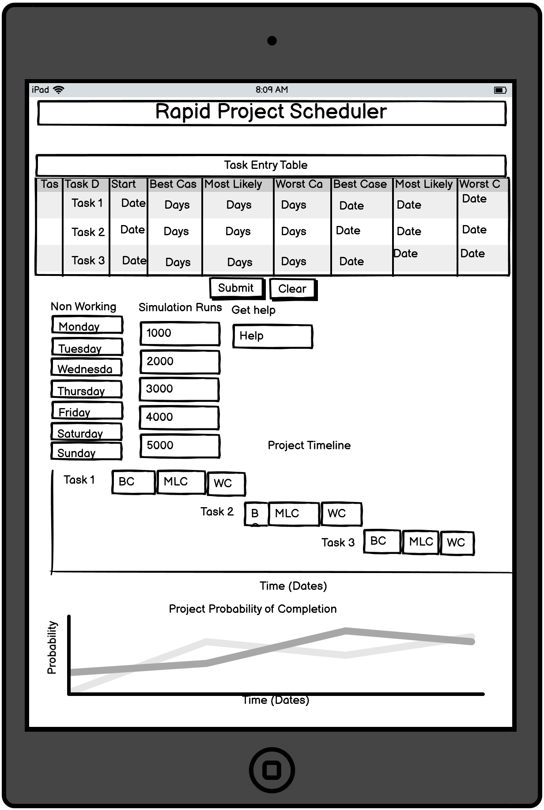{width=60%} 
*fig: Page rendered at 768px*

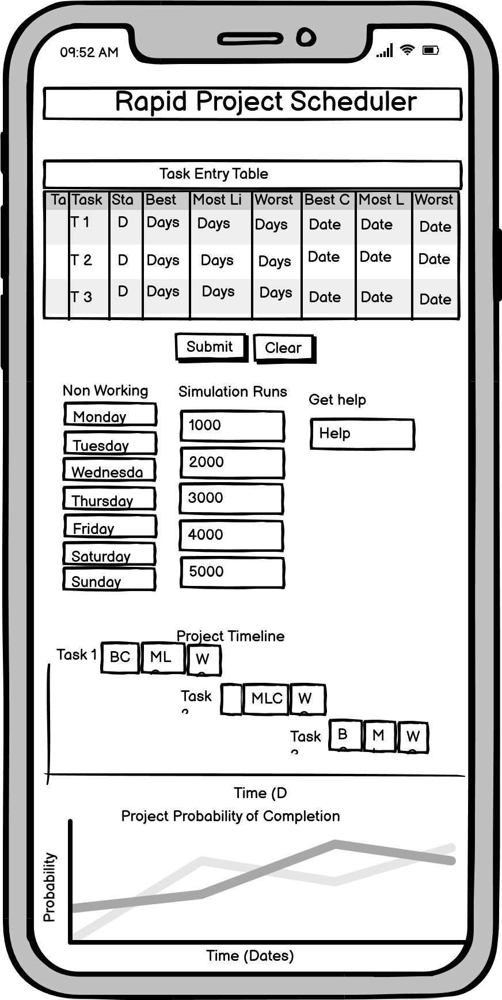{width=40%}
*fig: Page rendered at 320px*

Colours will be used to guide the user to make the correct associations between information presented by the web page.

Since preparing the wireframes described above a footer has been introduced to the page showing the authors contact details. The screenshots throughout the remainder of this document will depict the footer.

## 3.0 Features

### 3.1 Features Implemented

#### 3.1.1 The Task Entry Table

- As the user completes the entry of one row in the task entry table, a new blank row appears without a further request.

- The user may enter as many tasks as are required to plan the complete project.

- The user may select any date as the first start date: a past date, the present date or a future date. 

- Task numbers are automatically numbered from 1.

- Only the start date associated with the first task may be entered by the user.

- The start date associated with the first task may be in the present, past or in the future.

- Best case, worst case and most likely case dates are automatically determined for each task based on the non project days selected.

- The user may change either the best case duration, most likely case duration and worst case duration at any time after they have been initially entered and the associated completion dates will be recalculated.

- The start date of every task is the next project day following the worst case completion day of the previous task. If the worst case finish date of a task falls on a Friday and Saturday and Sunday have been selected as non project days, then the start date of the next task will be the following Monday.

- Until at least one task is fully entered, the submit button remains greyed out and disabled to prevent the simulation from running.

- Selecting fewer or more non project days using the non project days buttons causes the calculated best case, most likely case and worst case dates displayed by the task entry table to be recalculated.

- During simulation runs, the Non Project Days and Simulation run buttons are greyed out and disabled to prevent errors while running the simulation algorithm.

- Task table entries are error checked after the worst case duration is entered.

- A blank task row will not become available until the user has corrected all errors.

- Task table errors may be corrected at any time after initial entry and in any order.

- The restart button is always enabled and when clicked, reloads the complete page.

#### 3.1.2 Non Project Days & Simulation Runs Buttons

- The user may select from between 500 and 10000 simulation runs as informed by the legend on the buttons. The default is set to 500 simulation runs.

- The lower the number of simulation runs selected the faster the simulation will execute, however the less accurate the resulting risk profile plot. The higher the number of simulation runs, the longer the simulation takes to execute, but the more accurate the risk profile plot. This may only be obvious on slower machines.

- When a Simulation Runs button is clicked, it turns from green to red to indicate that it is active. All other Simulation Runs buttons will remain green.

- After clicking the Start button to commence the simulation, the Simulation Runs buttons are disabled and greyed out. This is to prevent errors occurring during the simulation. When the simulations has completed, the Simulation Runs buttons are reenabled and returned to their red/green status.

- The user may select any of the days of the week as non project days using the Non Project Days buttons.

- When the user clicks on one of the Non Project Days buttons, it's colour changes from green to red to indicate that the day of the week is now a non project day.

- Changes to Non Project Days are reflected in the calculation of the Best Case, Most Likely Case and Worst Case task completion dates shown by the task table.

- Saturday and Sunday are pre-selected as non project days on start-up, but may be made project days if required. 

- If the user attempts to select all 7 week days as non project days, then Monday will automatically be selected as the only project day. The user will be informed of the error through an error message. Selecting all 7 days of the week as non project days could result in a catastrophic failure and therefore is prevented.

- Adding or subtracting non project days does not restart the simulation. The Start button must be clicked for this to happen.

- Hovering over any button provides the user with a positive response increasing its brightness. 

#### 3.1.3 Timeline Plot & Risk Profile Plot

- The timeline plot is created using the Google Charts timeline API.

- The timeline plot is constructed to make the Best Case duration, Most Likely Case duration and Worst Case duration for a given task appear on one line.

- Hovering over a given line displays the start and finish dates associated with that task.

- The probability plot is created using the Google Charts line plot API.

- The probability plot shows the completion date for the entire project versus the probability of this occurring given the best case, most likely case and worst case task duration days provided in the task entry table.

- Hovering above a data point on the probability plot displays the project completion date and the probability of achieving the completion date.

- The date format displayed by the plots dd/mm/yy is the same as displayed by the task entry table. 

#### 3.1.4  Alert Modal Window

- The alert modal window appears when one of the following error conditions is detected:

- No start date has been entered into the task table against the first task.

- A task description has not been provided against a given task in the task entry table.

- The best case duration < most likely case duration < worst case duration.

- An irrecoverable error is detected in the task entry table prior to plotting. Note that plotting will not proceed should this be detected

- The user attempts to select all the days of the week as non project days.

- The alert modal window may be closed using the close button provided. 

#### 3.1.5 Help Modal Window

- The help modal window is displayed when the **Help** button is clicked. 

- The **Help** button may be clicked and will respond at any time during the use of this project planning tool.

- The help modal window display instruction to the user on how to operate the page and help with interpreting the results shown by the plots.

- the help modal window may be closed using the close button.

### 3.2 Future Features Possibilities

1. Add a full calendar from which the user is able to select specific non working days.

2. Replace the non working days selection buttons with resource availability buttons. The user could then select resource availability as a percentage of full availability.

3. Add a full Gantt chart with the project critical path displayed. A Gantt chart is available from Google Charts.

4. Replace the triangular probability distribution with a PERT probability distribution. While a PERT probability is not available as a stand alone library function, the Javascript library stdlib supports the Beta probability. The PERT probability distribution can be obtained from the Beta probability distribution by calculating the alpha and beta parameters from the Best Case, Most Likely Case and Worst Case values.

5. Permit two or more tasks to start on the same day.

6. Provide task relationships other than finish to start.

7. Use Googles cumulative histogram plot for the risk profile plot in place of the line plot currently used. The cumulative binning function could then be removed from the code as it is provided by the cumulative histogram plot. The use of the cumulative histogram plot was investigated, however it appeared not possible use dates on the x axis.

## 4.0 Technologies Used

- [JQuery](http://jquery.com)

  - The project uses JQuery to simplify DOM manipulation where appropriate. Table referencing by row and cell is more easily undertaken in JavaScript

- [Google Charts](https://developers.google.com/chart)

  - Google charts offers a wide variety of configurable charts with a common interface. More importantly, it provides a timeline chart central to the implementation of this project.

- [Plotly](https://plotly.com/javascript/)  

  - Plotly provides a simple to use charting library. Applications may be implemented in just a few lines of JavaScript. For this project Plotly was used to test the triangular probability distribution algorithm.
  
- [JavaScript](https://www.javascript.com/)
  
  - JavaScript is used extensively in this project to provide the interactive elements and to run the Monte Carlo simulation at its core.

- [HTML](https://html.spec.whatwg.org/)

  - Used to provide the static and non-interactive components for this project.

- [CSS](https://www.w3.org/Style/CSS/)

  - To provide styling for the HTML

- [Bootstrap](https://getbootstrap.com/)

  - To provide the grid system on which most of the HTML relies for presentation structure. 

## 5.0 Non Functional Requirements

The following non functional requirements must be met.

- 5.1 The HTML code  must pass validation by a suitable code validator.

- 5.2 The CSS code must pass validation by a suitable code validator.

- 5.3 The JavaScript code must pass validation by a suitable code validator.

- 5.4  The page must render identically in the Chrome, IE and Firefox browsers.

- 5.5 The page must be readable at screen widths of 1206px 768px and 320px.

## 6.0 Code Design Description

### 6.1 Data Structures and Handling

The task Start , Best Case, Most Likely and Worst Case durations are entered by the user into the task entry table. As the user enters the durations, the associated Best Case, Most Likely Case and Worst Case completion dates are determined and the task entry table is updated. The user also selects the Simulation Runs and Non Project days via a series of buttons. All data associated with these activities is stored in the DOM. No other data is required by the JavaScript programme.

Clicking the Start button results in the event handler function **monteCarlo()** being called. With regard to data handling function **monteCarlo()** undertakes three main tasks:

- Generate the Project Timeline Plot

- Run the Monte Carlo Simulation

- Generate the Project Risk Profile Plot

#### 6.1.1 The Project Timeline Plot

Function **monteCarlo()** starts by calling function **checkAllData()** to confirm that the task data stored in the task entry table is still correct.

Function **drawTimeLine()** is called by function **monteCarlo()**. Its purpose is to plot the timeline chart using Best Case, Most Likely Case and Worst Case completion dates provided by the task entry table. This application uses the Google Charts application to generate plots. The Google API requires data using in following data table definition.
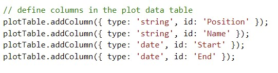{width=80%}

Function **drawTimeLine()** access Best Case, Most Likely Case and Worst Case dates directly from the task entry table by row and column reference and populates a Google defined data table again by row and column.

Note that the Best Case, Most Likely Case and Worst Case task completion dates assocaited with one task in the task entry table requires 3 rows in the Google API data table. This requires complex row and column addressing.

#### 6.1.2 The Monte Carlo Simulation

The next function called by function **monteCarlo()** is **runSimulation()**. This function is responsible for running the Monte Carlo simulation. Function **runSimulation()** declares an array **simRunsArray[]**. The click state of  Simulation Runs buttons determines the number of simultion runs required and determines the dimension of the  **simRunsArray[]**. Once the simulation runs are complete, the result of each run is stored in **simRunsArray[]**. Results are integer day durations for the project to complete. Function **runSimulation()** returns **simRunsArray[]**.  A more detailed description of the simulation process may be found in section 6.2.

Function **monteCarlo()** passes **simRunsArray[]** to function **resultProc()**. Function **resultsProc** declares a class **Results** and an array **frequencyBins[]** of objects class **Results**.

The function **resultProc()** executes a cumulative frequency binning function on the **simRunsArray[]** using a fixed number of 100 bins. Cumulative percentages, projectDays (the number of days required to complete the project at a given percentage probability) is stored in **frequencyBins[]**
Function **resultProc()** returns **frequencyBins[]**. 

Function **monteCarlo()** then passes this array to function **addProjectDates()**. Function **addProjectDates()** extracts the project duration days from **frequencyBins[]** and determines the assocaited project completion dates. Function **addProjectDates()** then pushes the project completion dates back into the array **frequencyBins[]** before returning it to function **monteCarlo()**.

Function **monteCarlo()** then passes array **frequencyBins[]** to function **drawProbabilityChart()**.

#### 6.1.3 The Project Risk Profile Plot

Function **drawProbabilityChart()** is responsible for plotting the project risk profile. It transfers the percentages and project dates from the **frequencyBins[]** to an array with a data structure required by the Google plotting API. As the project risk profile chart is a line chart, only completion dates and percentages are required from **frequencyBins[]**.  

### 6.2 JavaScript Code Structure and Flow

The JavaScript code may be considered as consisting of 7 components:

- Initialisation

- Task Entry

- Simulation Runs and Chart Plotting

- Restart

- User help

- Error alerting

- User Responsiveness

#### 6.2.1 Initialisation

The initialisation component is located at the top of the script and waits for the HTML page to load before initialising the:

- The Non Project Days Buttons

- The Simulations Runs Buttons

- The Start Button

- The Restart Button
  
 In this case initialisation means setting the correct background colour and state of the buttons. This is important as clicking on the Restart button will cause the page to fully reload and all parameters to reset.

 Finally the Google chart packages for plotting the project timeline and project risk profile charts are loaded.

#### 6.2.2 Task Entry

The task entry component is executed when the task entry table event listener is triggered. Function **taskUpdate()** is the event handler called.

The purpose of function **taskUpdate()** is to cycle through the task entry table updating the best case, most likely case and worst case completion dates from the best case, most likely case and worst case task durations newly entered or changed using function **calcWorkingDays()**. Function **calcWorkingDays()** adds the task duration to the start date omiting the non project days selected by the user.

Function **taskUpdate()** then checks that all the task table data ( task description, task start date, best task duration, most likely case task duration and worst case task duration) have been correctly entered and that a worst case task date is present. This is achieved through function **errorCheckRow()**.  If both these conditions are met, then a new task row is inserted into the DOM using fuctiion **addTableRow()** and the submit button is enabled using function **enStart()**

Note that with just one task fully entered, it is possible to run the Monte Carlo simulation, although the results have little significance.

#### 6.2.3 Simulation Runs and Chart Plotting

The Simulation Runs and Chart Plotting component is executed when the **Task Entry Table** event listener is triggered. Function **monteCarlo()** is the associated event handler.

Function **monteCarlo()** starts by disabling all the buttons. This is to ensure that the data required during the simulation remains unchanged.

A function **checkAllData()** is then called to confirm the integrity of every row in the task entry table. If **checkAllData()** returns false then the error handler is called and all buttons previously disabled, re-enabled and no plotting is undertaken. If **checkAllData** returns true then the following actions are taken:

- The HTML div element containing the timeline and risk profile charts is enabled.

- The function **drawTimeLine()** is called to plot the time line from the task entry table.

- The core simulation is run through function **runSimulation()**.

- The simulation run results are subjected to a cumulative binning function using function **resultsProc()** with the number of frequency bins defined by **DataPoints**.

- Function **addProjectDates()** converts the project duration days into project completion dates using the selected non project days.

- Function **drawProbabilityChart()** then plots the project risk profile chart using the binned data.

#### 6.2.4 Restart

The **restartPage** event listener is triggered on clicking the restart button, it calls event handler function **reLoad()**.

Function **reLoad()** reloads the entire HTML page and therefore restarts the JavaScript programme.

#### 6.2.5 Help Window

Clicking the Help button results in the event listener **getHelp** to be triggered

- Function **loadHelp()** enable the div with id myModal to be rendered in a modal window.

- A further event listener when triggered by clicking on the close icon in the help modal causes the help modal to close by disabling the div.

#### 6.2.6 Error Alerting

Task entry table errors are detected when new tasks are entered or changes made to existing tasks, prior to running the Monte Carlo simulation and when reading the state of the non project days buttons. Function **errorHandler()** is called when an error is reported. This opens up a modal window to display the appropriate error message. Further detail on error handling may be found in section 6.3 of this document.

#### 6.2.7 User Responsiveness

Event listeners are set up to detect when the user hovers the mouse pointer over any button. functions **hiLightButton()** and **loLightButton()** are then used to increase and decrease the brightness of the button. Please refer to credits ref.1 for acknowledgements regarding the source of this feature.

### 6.3 Error Handling

Errors are detected at  3 key points in the JavaScript code. The user is alerted to errors through a single **errorHandler()** function.

1. As the user enters each row into the task entry table

2. Prior to running the simulation

3. On reading the state of the Non Project Day Buttons

#### 6.3.1 Task Entry Table Error Detection 

Function **errorCheckRow()** is called after the user has entered the best case , most likely case and worst case duration for a task entered via the task entry table and before a new task line is added to the table.

Function **errorCheckRow()** performs 8 checks on a task entry row.

- A task description has been entered **error code 4**.

- The task description string starts with an alpha numeric character. Note that subsequent task characters in the task description string may be non alphanumeric **error code 7**.

- A task start date has been entered **error code 0**.

- A task start date is in the range +/- 10 years of the present date **error code 10**.

- For each task row the Best Case Durations < Most Likely Case Durations < Worst Case Durations **error code 5**.

- For each task row the Best Case Durations && Most Likely Case Duration && Worst Case Duration values entered are greater than 1 **error code 2**

- For each task row the Best Case Durations && Most Likely Case Duration && Worst Case Duration values entered are positive **error code 9**

- For each task row the Best Case Durations && Most Likely Case Duration && Worst Case Duration values entered are integer **error code 8**.

#### 6.3.2 Simulation Run

Prior to running the Monte Carlo simulation function **montecarlo()** calls function **checkAllData()**.  As it is possible for the user to change data entered via the task entry table and as all data is held in the DOM, function **checkAllData()** loops through each task entry row using function **errorCheckRow()** and confirms that no errors have been introduced. If errors have been introduced, then the simulation is not run and the timeline and probability charts not produced.

#### 6.3.3 Non Project Days

If the user attempts to select every day of the week as a non project day, then function **calcWorkingDays()** reports **error code 3**. Function **calcWorkingDays()** also makes Monday the only project day and avoids a catastrophic error.

#### 6.3.4 Error Reporting

Function **errorHandler()** inputs a unique error code and displays a single error message via a modal window. An event listener is then setup so that the user can click on the close button to close the modal window. Using an error handler in this way allows more errors to be reported should should further changes to the JavaScript code require it.

### 6.4 Running the Monte Carlo Simulation

Function **runSimulation()** is a core component of the code responsible for running the Monte Carlo simulation.

This function starts by determining which "simulations runs" button has been clicked to determine the number of iterations over which the simulation will be run.

For each task in the task entry table a random variat **variat** between the best case duration and worst case duration is determined using function **randomVariat()** and added to that of the next task. The total is then one simulation run and represents one probable outcome for the duration of the project. The number of times this is repeated is determined by the number of simulation runs.

At the end of these loops, array **simRunsArray[]** contains the number of probable project duration outcomes set by "simulation runs". Note that the most likely case task duration is required by **randomVariat()** because **variat** is a triangularly distributed variable.

Function **resultsProc()** inputs the **simRunsArray[]** and the number of datapoints **dataSamples** to be plotted by the project risk profile plot.

From **simRunsArray[]** and **dataSamples** this function determines a bin width and using two loops determines bin counts for each **dataSamples**. As this is cumulative, the final sample includes all of the values in **simRunsArray[]**. Note that Google Charts provides an API for cumulative histogram which would have obviated the need for this function. This was investigated. Unfortunately, there seemed no obvious way of attaching dates to the x axis so abandoned. 

## 7.0 Testing

### 7.1 Test Approach

Functional testing will be based on User Stories and the individual requirements derived from them [2.1 Detailed Requirements](#5-0-detailed-requirements). The associated test methods, expected outcomes, tested outcomes and results are documented in document  [TEST.md](https://github.com/ChrisH2727/Milestone-2/blob/master/TEST.md) 

Non functional testing will be based on the non functional requirements set out in section 5.0

### 7.2 Defects Fixed

| **No.**|**Defect**                                                                                                                                                                                                           |**Solution**   |
| -------|-------------------------------------------------------------------------------------------------------------------------------------------------------------------------------------------------------------------- |------|
| 1.     |Even thought the HTML input returns a date string format dd/mm/yyyy, JavaScript new Date fails to return a date object.                                                                                              |Write a short functions that converts a date string format dd/mm/yy to format yyyy-mm-dd                                                                                                                                 |
| 2.     |The Task Description field in the Task Entry Table accepted space characters as valid input. While space characters are acceptable in the Task Description Field, the first character should always be alphanumeric. |Introduce check using the regex (/^[0-9a-zA-Z]+$/) to confirm that the 1st character is always numeric and raise error.                                                                                                  |
| 3.     |The Task Duration fields accepted non integer values.                                                                                                                                                                |Introduce check on the Task Duration values entered by the user  and raise error if not integer.                                                                                                                         |
| 4.     |The IE browse reverses the day of the week and month of year with respect to the Firefox and Google browsers.                                                                                                        |To maintain compatibility across all three browsers added the "en-GB" parameter the the method **toLocaleDateString("en-GB")**.                                                                                          |
| 5.     |Google Developer Tools reported an unreachable reference when the HTML page loaded                                                                                                                                   |Removed the offending reference.                                                                                                                                                                                         |
| 6.     |On testing JavaScript function checkAllData() was found to check all Task Table entries and therefore reporting only the last error found                                                                            |Refactored the loop to use a break when the first error in the Task Entry Table is detected                                                                                                                              |
| 7.     |The close button associated with the help modal window appears on the left hand side                                                                                                                                 |Fixed in the HTML file by moving the span element inside the paragraph element containing the help text.                                                                                                                 |
| 8.     |The task entry table and the two plots all used different date formats                                                                                                                                               |For the time line plot the solution involved adding a format parameter with dd/mm/yy to the options parameter. For the line plot this did not work and the date object required reconstruction. found by trial and error!|
| 9.     |Function calcWorkingDay() sets Monday as a project day if the user inadvertently sets every days of the week to a non project day. The "click" state of Monday was incorrectly set.                                  |Change the click state of Monday from "true" to "false"                                                                                                                                                                  |
| 10.    |On testing discovered that the state associated with error condition 6 was unreachable.                                                                                                                              |Removed the code assocaited with reporting this error state.                                                                                                                                                             |
| 11.    |On testing discovered that out of range dates could be entered as the initial start date.                                                                                                                            |An error trap was introduced limiting the date range to +/- 10 years within the present the current date.                                                                                                                |
| 12.    |Timeline plot and risk profile plot would not render side by side as required                                                                                                                                                                       |  Fixed by enclosing the two plot columns inside another row and col div.    |

### 7.3 Residual Defects

- It is not possible to enter task data into the task table or select any of the buttons while the help window is displayed. It would be a more user friendly experience if the main page  could be operated while the help window were displayed.

- No check is performed to ensure that unique task descriptions are entered against each task.

- When running Google developer tools over a local source of the project no console errors appear. When running Google developer tools running from GitHub Pages, a number of console errors appear with reference to Google. This will need to be investigated. Google developer tools also displayed `Failed to load resource:/favicon.ico the server responded with a status of 404 ()` when running from GitHub Pages. Reloading the page causes this error to be removed!

- The width of the task entry table makes operation on small screen widths difficult. Using the standard scaling command `<meta name="viewport" content="width=device-width, initial-scale=1.0">` resulted in the task entry table togther with the plots not being viewable on small screen sizes. Further work is needed to optimise this.

- When viewing the timeline plot, the tooltips box display an incorrect task duration although dates are correct. Firstly the task duration includes non project days and secondly it would be more informative if the durations were cumulative. This will need further investigation.

- The tooltips for both the timeline plot and the risk profile plot show dates in a different to that used by the x axis. This will need further investigation.  

## 8.0 Deployment

The project is deployed through GitHub pages and may be loaded via the following link  [Milestone 2 project](https://chrish2727.github.io/Milestone-2/). The following steps are required to deploy the project:

1. Sign-on to GitHub

2. Select the [Milestone 2](https://github.com/ChrisH2727/Milestone-2) repository.

3. In the GitHub page click on SETTINGS. **Milestone-2** is displayed in the repository name.

4. From the side bar click "Pages".

5. Check that the Master Branch has been selected as the source.

6. Click "save".

7. The URL for the [deployed project](https://chrish2727.github.io/Milestone-2/) is displayed in the green box.

8. Accessing the URL [deployed project](https://chrish2727.github.io/Milestone-2/) after 15 minutes and performing a quick positive test confirmed that it had been successfully deployed.

## 9.0 Maintenance and Further Development

**The GitHub repository associated with this project may be found at:  [Milestone 2](https://github.com/ChrisH2727/Milestone-2)**.

The project may be cloned to the desired directory on a local machine using the following steps:

1. Open a GiTBash window on the local machine.

2. Navigate to the directory location where the cloned version of this project is required.

3. From a browser navigate to `https://github.com/ChrisH2727/Milestone-2`.

4. Click on the code button and then select HTTPS.

5. Copy the URL `https://github.com/ChrisH2727/Milestone-2.git`

6. In GiTBash window enter git clone and the above URL.

Note, that while branches have been used, please stick to the main branch.

If project is to be deployed locally, then the following folder structure is assumed and must be maintained:
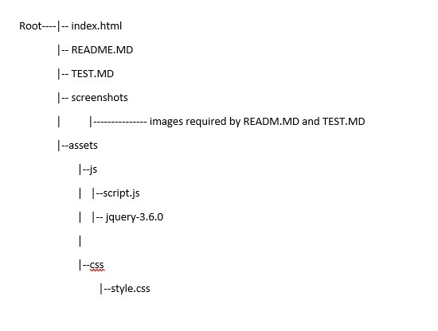

## 10.0 Acknowledgements & Credits

### 10.1 Code Credits

1. This line of code makes use of the idea presented here: [CSS Lighten an element on hover](https://stackoverflow.com/questions/16178382/css-lighten-an-element-on-hover), but this was then augmented with the use of a JQuery event listener. My challenge here was to write a single line of code that would lighten a button's background when hovered over without reference to the actual background colour.

2. Help modal inspiration taken from [Help Window](https://www.w3schools.com/howto/howto_css_modals.asp). The behaviour was however modified such that the behaviour close button is via a Jquirey function rather than CSS.

3. The timeline and line chart APIs were sourced from  [Google Timeline Charts](https://developers.google.com/chart/interactive/docs/gallery/timeline) [Google Line Charts](https://developers.google.com/chart/interactive/docs/gallery/linechart) as was the code for interfacing to them.

4. Assistance provided on how to detected alphanumeric characters.  [Alphanumeric](https://www.w3resource.com/javascript/form/letters-numbers-field.php)

### 10.2 Content Credit

- The following [Wikipedia](https://en.wikipedia.org/wiki/Triangular_distribution) reference provides an excellent source of information on the triangular probability distribution.

### 10.3 Media Credit

- Icons used as part of the footer design are courtesy of [Fontawesome](https://fontawesome.com/).

## Annex 1. Triangular Probability Distribution

Although the equations for generating a triangularly distributed variable are generally available, no examples of coding in Javascript are available, and since this is key to the operation of the web page, it was worthy of further investigation.

The equation for generating a triangularly distributed variable from a linearly distributed variat is given by the following equations:

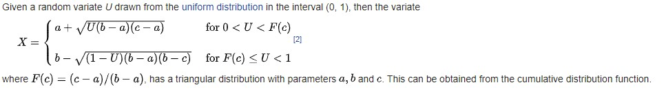{width=100%}
*[Insert courtesy of Wikipedia](https://en.wikipedia.org/wiki/Triangular_distribution)*

As the correct functioning of the triangular probability distribution is crucial to the operation of the Monte Carlo simulation and to the operation of the web page, a test plot was generated to confirm that the Javascript code implementing the above equations.

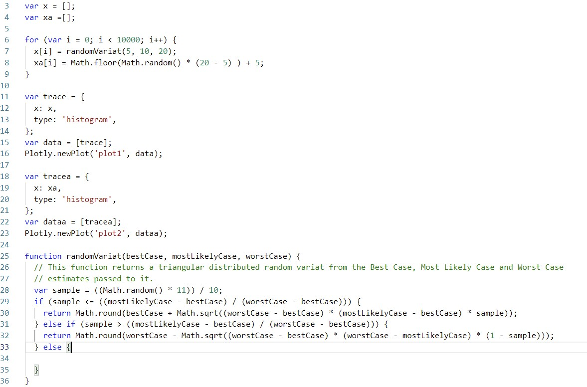{width=100%}

The above code snip generated the following 2 plots. The right hand plot shows the distribution of Javascript's native random number generator between the values of 5 and 20 and the left hand plot shows the same number range with the triangular probability distribution applied. As may be seen this is clearly "triangular" in shape. Both plots used a sample size of 10,000. Note, that had the linear probability distribution shown significant bias, then it would not have been possible to use this method of generating the triangular probability distribution.

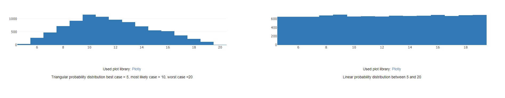{width=100%}
*fig: Linear probability distribution vs triangular probability distribution*
