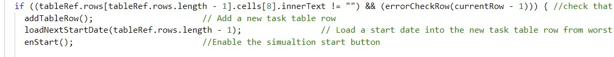
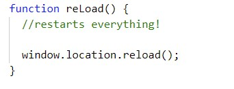

# Milestone Project 2 - Fast Project Scheduling

## Table of Contents

    1.0 Introduction
        1.1 Why The Project?
        1.2 Some Project Planning Basics
        1.3 Monte Carlo Simulation
        1.4 Random Numbers and All That

    2.0 UX
        2.1 User Stories
        2.2 Strategy
        2.3 Structure
        2.4 (Surface) Wireframes

    3.0 Features
        3.1 Features Implemented
            3.1.1 Section 1 - The Task Entry Table
            3.1.2 Section 2 - Non Working Days & Simulation Runs Buttons
            3.1.3 Section 3 - Timeline Plot & Probability Plot
            3.1.4 Section 4 - Alert Box
        3.2 Future Features Possibilities
    
    4.0 Technologies Used
    
    5.0 Detailed Requirements
        5.1 Functional Requirements
        5.2 Non Functional Requirements

    6.0 Code Design Description
        6.1 Data Structures and Handling
        6.2 JavaScript Code Stucture and flow
        6.3 Error Handling
        6.4 Javascript Functions

    7.0 Testing
        7.1 Test Approach
        7.2 Test Cases & Test Execution
        7.3 Residual Defects

    8.0 Deployment

    9.0 Acknowledgements & Credits

    Annex 1. Triangular Probability Distribution

## 1.0 Introduction

### 1.1 Why The Project?

As a project manager I have on many occasions been set the challenge of generating a high level project schedule for the development of a new product or an enhancement to an existing product. Often I am asked to consider more than one option and to consider the risks associated with each option.  Somehow such requests usually come about a few days before the next board meeting. While the resulting project schedule(s) appear simple, the effort required to generate such a project schedule can be significant and disruptive to the project team. This need not be the case if an appropriate scheduling tool is used. While there are many project planning tools available that can meet this challenge, they are complex to use and often require significant of initial set up.

My proposed browser based planning tool overcomes many of the problems by providing a simple interactive user interface that focuses on the need to produce project timeline together with an analysis of the assocaited risks.

### 1.2 Some Project Planning Basics

While agile project management methodologies are used by virtually every organisation involved in development work, they are of little use when preparing an initial project schedule(s) for the project board. The project board will want to know, how long will the project take to complete, what options have been considered and have the associated risks been taken into consideration. Project costs can usually be determined at least at a high level from the schedule. Details rarely matter at this stage.

It has been common practice to estimate the duration of project stages or tasks using a 3 point estimate:

Best Case:  where it is assumed that nothing goes wrong.

Worst Case: where everything that will go wrong does go wrong

Most Likely Case: somewhere between the Best Case and Worst Case estimates based on the project team's past experience

For a simple project schedule where each task or stage has a finish to start relationship with its successor,  total project duration will be the sum of all the individual task or stage durations. Summing the Most Likely durations means that risks have not been factored in and therefore not a reflection of how long the project will take to complete. Summing all the Worst Case durations means that all the risks will mature. This again is unlikely to turn out to be true. In reality, the actual duration of the project will lie somewhere between the sum of the Best Case estimates and the sum  of the Worst Case estimates. Assocaited with this is also a risk profile, with the project accepting a high level of risk and a low probability of completion at the Best Case estimate date and the project accepsting a low level of risk and a high probability of completion at the Worst Case estimate date. It is then up to the project board to decide not only which project option to choose, but also the delivery date dependant on their risk appetite. For example, some project boards may decide that planning on an earlier date completion date with a 50% probability is acceptable, while other project boards may decide that a 70% probability is required with the assocaited later project completion date.

### 1.3 Monte Carlo Simulation

A [Monte Carlo simulation](https://en.wikipedia.org/wiki/Monte_Carlo_method) can be used to create a statistical model of the project and may be used to determine not only the likely finish date for the project, but also the associated probability of doing so.

For project scheduling application Monte Carlo simulations involves selecting a random (in the next section we will talk more about what random means) duration task or project stage duration between the Best Case estimate and the Worst Case estimate. By iterating through this process many times we end up with a range of project durations outcomes. The probabilty of achieving a given project duration is given by the fraction of times the project duration was achieved out of all the times that the processes was itterated. In essence, it is as if we were running the project many times and looking to see how many times a given project duration was achieved. Key to a successful Monte Carlo simulation is chosing the right random number distribution.  

### 1.4 Random Numbers and All That

Most programming languages include a function to generate a random number, either in the range 0 -1 or some other numerical range. Javascript is no exception, however as with other programming languages Javascript generates random numbers with a linear probability of occurrence. For example, the probability of the random() fuction generating 0.9 as the next number is the same as generating 0.7. Unfortunately project task durations do not follow a linear distribution. The probability of a project task requiring the worst case duration is in reality lower than the probability of the task requiring the most likely time to complete. When selecting a random task duration between the best case and worst case for our Monte Carlo simulation we need to take this into consideration. Fortunately this has all been taken care of by the [PERT probability distribution](https://en.wikipedia.org/wiki/PERT_distribution).

While the PERT distribution is not native to Javascript or JQuery, it is relatively simple to generate a random number with a [triangular probability distribution](https://en.wikipedia.org/wiki/Triangular_distribution). Although not ideal, for the purpose of this project the triagular probability distribution will be sufficient.

## 2.0 UX

### 2.1 User Stories

1. As a project manager I want an online highlevel project planning tool so that I can rapidly assemble a project schedule.

2. As a project manager I want a project planning tool that will accomodate project risks using the well tried and widely understood 3 point estimate: "Best Case", "Most Likely Case" and "Worst Case" approach.

3. As a project manager I want a project planning tool that will calculate a range of probable project completion dates so that the project board can select an option dependant on their appetite for risk.

4. As a project manager I want a project planning tool that will permit me to enter 3 point task estimates (Best Case Estimate, Most Likely Case Estimate and Worst Case Estimate) in man days and have the task completion dates calculated for me.

5. As a project manager I want a project planning tool that allows me to enter 3 point estimates in tabular form similar to other project planning tools that I am familiar with.

6. As a project manager I want a project planning tool that will allow me to select non working days as a means of controling project resource availability.

7. As a user I want to be able to change my three point task duration estimates and have the planning tool recalculate the task completion dates. 

8. As a user I want information that is not complete not relevent hiden to prevent unnecessary information overload.

9. As a user I want to be informed of any errors that I may make entering data so that I can correct these before moving on.

### 2.2 Strategy

The purpose of this web site is to provide project managers with a high level project scheduling tool that encompases risk management again at a high level. This project scheduling tool is not intended to be used for day to day planning activities. It is intended that this project scheduling tool should be simple and intuitive to use.

### 2.3 Structure

This project consists of a single web page.

Discrete buttons are used to allow the user to select options or initiate actions. In some cases such as the selection of non project days or the number of simulation runs, the use of radio buttons was considered, but discounted as they did not provide the desired visual impact.

Not every component of the web page is rendered on loading. As will be discussed later on, only those components that the user use or provides useful information is rendered. 

### 2.4 (Surface) Wireframes

The web page may be considered in terms of 3 distinct section with the addition of 2 modal windows. 

1. Section 1 Top left - provides a task entry table. 

2. Section 2 Top right - provides buttons for selecting non working days, the number of simulation runs and a help button.

3. Section 3 Middle - provides a timeline for the tasks entered by the user and a probability chart detailing the probability of compleing the project by a given date.

4. The **Help** modal is rendered when help button is clicked.

5. The **Alert** modal is rendered when ever the programme detects an error in the entry of task data via the Task Entry Table.

On first loading, the page will be rendered as follows:

  
The charts will not be rendered until task data has been entered and the submit button clicked.

Clicking on the **Help** button will render the help modal. This will provide the user with instructions on how to use the Rapid Project Scheduler.

If an error is detected in the entry of task data via the **Task Entry Table** then an alert modal window is rendered.

The Alert and Help modal windows are rendered at the different screen widths supported by this project. 

*fig: Full screen width 1206px*

The web page will render to provide a readable display at 1206px, 768px and 320px screen widths. The wireframes below show the contents of the web page without either the alert or help modal windows.

Web page rendered at 1206px.

Web page rendered at 768px

Web page rendered at 320px

Colours will be used to guide the user to make the correct assocaitions between information presented by the web page.

## 3.0 Features

### 3.1 Features Implemented

#### 3.1.1 Section 1 - The Task Entry Table

* As the user completes the entry of one line in the task entry table, a new blank line appears automatically.

* The user may enter as many tasks as are required to plan the complete project

* Task numbers are automatically numbered from 1.

* Only the start date assocaited with the first task may be entered by the user.

* The start date associated with the first task may be in the past or in the future.

* Best case, worst case and most likely case dates are automatically determined for each task based on the non working days selected .

* The user may change either the best case duration, most likely case duration and worst case duration at any time and the associated dates will be recalculated.

* All tasks have a best case finish to best case start relationship with the subsequent task.

* With the exception of the first task, start date of a task is the next working day following the worst case finish date of the previous task. If the worst case finish date of a task falls on a Friday and Saturday and Sunday have been selected as non workng days, then the start date of the next task will be for the Monday.

* Until atleast one task is fully entered, the submit button is greyed out and disabled to prevent the simualtion from running.

* Selecting fewer or more non working days using the non working days buttons causes the calculated best case, most likely case and worst case dates displayed by the task entry table to be recalculated. 

* During simulation runs, the Non Working Days and Simulation run buttons are greyed out and disabled to prevent errors while running the simulation algorthm.

* The Best Case duration, Most Likely Case duration and Worst Case duration are checked to confirm that Best Case duration <  Most Likely Case duration < Worst Case duration. A new task line will not be added to the task table is this is not true. The user is alerted to this error.

* If the user fails to enter a task description, a task line will not be added to the task table. The user is alerted to this error.

* Task table errors may be corrected at any time and in any order.

* The restart button is always enabled and when clicked, reloads the complete page.

#### 3.1.2 Section 2 - Non Working Days & Simulation Runs Buttons

* The user may select from between 1000 and 5000 simulation runs as informed by the legend on the buttons. The default is set to 1000 simulation runs

* When the Simulations Runs button is clicked, it turns from green to red. It's status is used to determine how many simulations to execute

* Clicking on one Simulation Runs button extinguishes all other Simuation Runs buttons.

* After clicking the Start button to commence the simulation, the Simulation Runs buttons are disabled and greyed out. This is to prevent errors occuring during the simulation. When the simulations has completed, the Simulation Runs buttons are reenabled and returned to their red/green status.

* The user may select any of the days in the week as non working using the Non Working Days buttons.

* When the user clicks on one of the Non Working Days buttons, it's colour changes from green to red.

* Saturday and Sunday are pre-selected as non working days, but may be made working days. 

* If the user attempts to select all 7 week days as non working, then Monday will automatically be selected as the only working day. The user will be informed of the error through an error message. Selection all 7 days of the week as non working days could result in a catastrophic failure and therfore is prevented.

* Adding or subtracting Non working days automatically adjusts the Best Case, Most likely and Worst Case dates displayed by the task entry table.

* Adding or subtracting Non working days does not restart the simulation. The Start button must be clicked for this to happen.

#### 3.1.3 Section 3 - Timeline Plot & Probability Plot

* The timeline plots and probability plots are rendered using Google Charts.

* The timeline plot is constructed to make the Best Case duration, Most Likely Case duration and Worst Case duration for a given task appear on one line.

* Hovering over a given line displays details of the task

#### 3.1.4 Section 4 - Alert Box

The alert box appears when one of the following error conditions is detected:

* No start date has been entered into the task table.

* A task description has not been provided.

* All days of the week have been selected as non working.

### 3.2 Future Features Possibilities

1. Add a full calandar from which the user is able to select specific non working days.

2. Replace the non working days selection buttons with resource availability buttons. The user could then select resource availability as a pecentage of full availability.

3. Add a full Gantt chart with the project critical path displayed. A Gantt chart is available from Google Charts.

4. Replace the triangular probablity distribution with a PERT probability distribution. While a PERT probability is not a available as a stand alone library function, the Javascript library stdlib supports the Beta probability. The PERT probability distribution can be obtained from the Beta probability distribution by calculating the alpha and beta parameters from the Best Case, Most Likely Case and Worst Case values.

## 4.0 Technologies Used

* [JQuery](http://jquery.com)

  * The project uses JQuery to simplify DOM manipulation where appropriate. Table referencing by row and cell is more easily undertaken in javaScript

* [Google Charts](https://developers.google.com/chart)

  * Google charts offers a wide variety of configurable charts with a common interface. More importantly, it provides a timeline chart central to the implementation of this project.

* [Plotly](https://plotly.com/javascript/)  

  * Plotly provides a simple to use charting library. Applications may be implemented in just a few lines of javaScript. For this project Plotly was used to test the triangular probability distribution algorithm.

## 5.0 Detailed Requirements

This section colates and numbers individual requirements from this document for test purposes.

### 5.1 Functional Requirements

### 5.2 Non Functional Requirements

5.2.1 The HTML code  must validation by a suitable code validator.

5.2.2 The CSS code must pass validation by a suitable code validator.

5.2.3 The JavaScript code must pass validation by a suitable code validator.

## 6.0 Code Design Description

### 6.1 Data Structures and Handling

Start, Best Case, Most Likely and Worst Case dates together with the number of times that simulation is required to run is stored in the DOM. No other variable data is required.

Clicking the Start button results in the event handler function **monteCarlo()** being called. With regard to data handling this function undertakes two activities:

1. Function **drawTimeLine()** is called to plot the timeline chart using Best Case, Most Likely Case and Worst Case dates determined from task duration entries provided  via the Task Entry table. The Google API requires data using in following class definition.

    

   Apart from calling the Google function to create the timeline plot, it is the function of **drawTimeLine()** to take the Best Case, Most Likely Case and Worst Case dates from the Task Entry Table and format it into an array of objects of the above class. 

   The next function called by **drawTimeLine()** is **runSimulation()**. This function is responsible for running the actual Monte Carlo simulation. Function **runSimulation()** declares an array **simRunsArray** and reads the status of the Simulation Runs buttons to determine the number of simultion runs and to determine the dimension of the  **simRunsArray** array. The remaining code runs the simulation and stores the result in **simRunsArray**. Results are integer day durations for the project to complete. Function **runSimulation()** returns **simRunsArray**.

2. The event handler **monteCarlo()** passes **simRunsArray** to function **resultProc()**. Function **resultProc()** is essencially a "binning function". Function **resultProc()** declares a class **Results** and an array **histoArray** of objects class **Results**.

   

   The function **resultProc()** then executes a cumulative frequency binning function on the **simRunsArray** using a fixed number of 20 bins. 20 bins was chosen as it provides a trade-of between speed of execution and readability of the probability plot. Cumulative percentages, projectDays (the number of days required to complete the project at a given percentage probability) is held in **histoArray**

   Function **resultProc()** returns **histoArray**. Function **monteCarlo()** then passes this array to function **addProjectDates()**. Function **addProjectDates()** extracts the project days from **histoArray** and determines the assocaited project completion dates. Function **addProjectDates()** then pushes the project completion dates back into the array **histoArray** before returning it to function **monteCarlo()**.

   Function **monteCarlo()** then passes array **histoArray** to function **drawProbabilityChart()**. Function **drawProbabilityChart()** transfers the percentages and project dates from the **histoArray** to the array with data structure required by the Google plotting API. 

### 6.2 JavaScript Code Stucture and flow

The JavaScript code may be devived into 3 main components parts:

1. The 1st component part located at the top of the script waits for the HTML page to load before initiallising the:

   * The Non Project Days Buttons

   * The Simulations Runs Buttons

   * The Start Button

   * The Restart Button
  
    

   In this case initialisation means setting the correct background colour and state of the button. This is important as clicking on the Restart button will cause the page to fully reload and all parameters to reset.

   Finally the Google chart packages for plotting the project timeline and probability charts are loaded.

2. The 2nd component part is executed when the **Task Entry Table** event listener is triggered:

    

   The purpose of function **taskUpdate()** is to cycle through the **Task Entry Table** updating the project completion dates from the task durations newly entered or changed. To start with, it takes the worst case finish date generates and loads the start date for the next task in the table using function **loadNextStartDate** 

    

   Function **loadNextStartDate** finds the worst case finish date and adds one day to it for the next task start date. Note that if the next day is non project day then it will omit that day. For example if the worst case finish date is a Friday and Saturday and Sunday have been selected as non project days, then the start date of the next task will be the Monday.

   Function **taskUpdate()** then cycles through the best case, most likely case and worst case task durations calculating the best case, most likely case and worst case completion dates.

   

   Again, non project days are ommited in the determination of the finish date. This is achieved through function **calcWorkingDays()**

   Finally function **taskUpdate()** checks that all the task table data ( task description, task start date, best task duration, most likely case task duration and worst case task duration) has been correctly entered and that a worst case task date is present.This is acheived throught function **errorCheckRow()**.  If both these conditions are met, then a new task row is inserted into the DOM using fuctiion **addTableRow()** and the submit button is enabled using function **enStart()**

   

   Note that with just one task fully entered, it is possible to run the Monte Carlo simulation, although the results have little significance.

   Given the cohesive design of function **taskUpdate()** it can be called from anywhere else in the programme.

3. The 3rd component part is executed when the **Task Entry Table** event listener is triggered:

    

   Function **monteCarlo()** starts by disabling all the buttons. This is to ensure that the data required during the simulation remains unchanged.

   

   A function **checkAllData()** is then called to confirm the integrity of the task entry table. If **checkAllData()** returns false then the error handler is called and all buttons previously disabled, re-enabled. If **checkAllData** returns true then the following actions are taken:

    * A constant **DataPoints** is declared.

    * The div element containing the timeline and probability charts is enabled.

    * The function **drawTimeLine()** is called to plot the time line from the task entry table.

    * The core simulation is run through function **runSimulation()**.

    * The simulation run results are subjected to a cumulative binning function using using function **resultsProc()** with the number of frequency bins defined by **DataPoints**.

    * Function **addProjectDates()** converts the project duration days into dates using the selected non project days.

    * Function **drawProbabilityChart()** then plots the probability chart using the binned data and the **DataPoints**.

4. When the **restartPage** event listener is triggered on clicking the restart button, it calls function **reLoad()**. 

    

   Function **reLoad()** reloads the entire HTML page and therefore restarts the JavaScript programme.

   

5. Clicking the Help button results in the event listener **getHelp** to be triggered

    

    Function **loadHelp()** enable the div with id myModal to be rendered in a modal window.

   

   A further event listener when triggered by clicking on the close icon in the help modal

    

      causes the help modal to close by disabling the div.

6. The remaining event listeners have been included to provide the user with a positive response when hovering over a button. Please refer to credits ref.1 for acknowledgements regarding the source of this feature.  

   

### 6.3 Error Handling

Errors are detected at seveal points in the JavaScript code, but reporting is centalised through a single **errorHandler()** function.

Function **errorHandler()** inputs a unique error code and displays a single error message. An event listener is then setup so that the user can click on the close button to close the modal window. Using an error handler in this way allows more errors to be reported should should further changes to the JavaScript code require it.

Function **errorCheckRow()** is called after the user has entered the best case , most likely case and worst case duration for a task entered via the task entry table and before a new task line is added to the table.

Function **errorCheckRow()** performs 3 checks on a task entry row:
 
* Checks that a task description has been entered

* Checks that a task start date is available.

* Checks that Best Case Durations < Most Likely Case Duration < Worst Case Duration.

It then reports the error via function **errorHandler** returns a **false** if an error is found. Note that function **taskUpdate()** is prevented from allowing a new task line to be added, but is permitted to run to completion. This gives the user the oportunity of correcting any errors in the entry of a task.

Function **monteCarlo()** also initiatates error checking. Here function **checkAllData()** is used to confirm that the task entry table does not include errors before any charting is undertaken. Function **checkAllData()** loops round all the task table rows using function **errorCheckRow()**. If a task table error is detected at this point then charting is prevented and an additional error is reported inviting the user to re-enter the complete task entry table.  

### 6.4 JavaScript Functions

While operation of most of the critical JavaScript functions have been described in the above two sections, a few non trivial functions still require identification.

Function **runSimulation()** is a core component of the Programme.

 

This function starts by determining which "simulations runs" button has been clicked. 

For each task in the task entry table a random variat **variat** between the best case duration and worst case duration is determined using **randomVariat()** and added to that of the next task. The total is then one simulation run and represents one probable outcome for the durtation of the project. The number of times this is repeated is determined by the number of simulation runs.

At the end of these loops, array **simRunsArray[]** contains the number of probable project duration outomes set by "simulation runs". Note that the most likley case task duration is required by **randomVariat()** because **variat** is a triangularly distributed variable. 

Function **resultsProc()** inputs the **simRunsArray[]** as **numbers[]** and the number of datapoints **dataSamples** to be plotted by the probability plot. 

 

From **numbers[]** and **dataSamples** this function determines a bin width and using two loops determines bin counts for each **dataSamples**. As this is cumulative, the final sample includes all of the values in **numbers[]**. Note that Google Charts provides an API for cumulative histogram which would have obviated the need for this function. This was investigated. Unfortunately, there seemed no obvious way of attaching dates to the x axis so abandoned. 

## 7.0 Testing

### 7.1 Test Approach

......

### 7.2 Test Cases & Test Execution

........

### 7.3 Residual Defects

## 8.0 Deployment

The project is deployed through GitHub pages and may be loaded via the following link  [Milestone 2 project](https://chrish2727.github.io/Milestone-2/).

## 9.0 Maitenance and Further Development

The project may be cloned to the desired directory using the command gh repo clone ChrisH2727/Milestone-2

The following folder stucture is assumed and must be maintained:

## 9.0 Acknowledgements & Credits

1. This line of code makes use of the idea presented here: [CSS Lighten an element on hover](https://stackoverflow.com/questions/16178382/css-lighten-an-element-on-hover), but then augments it with the use of a JQuery event listener. My challenge here was to write a single line of code that would lighten a button's background when hovered over without reference to the actual background colour.

2. Help modal inspiration taken from https://www.w3schools.com/howto/howto_css_modals.asp however modified such that the behaviour close button is via a Jquirey function rather than CSS

3. The timeline and scatter chart APIs were sourced from  https://developers.google.com/chart/interactive/docs/gallery/timeline as was the code for interfacing to them.

## Annex 1. Triangular Probability Distribution

Although the equations for generating a triangularly distributed are generally available, no examples of coding in JavaScript are available, and since this is key to the operation of the web page, it was worthy of further investigation.

The equation for generating a triangularly distributed variat from a linearly distributed variat is given by the following equations:

*Insert courtsey of Wikipedia*  (https://en.wikipedia.org/wiki/Triangular_distribution)