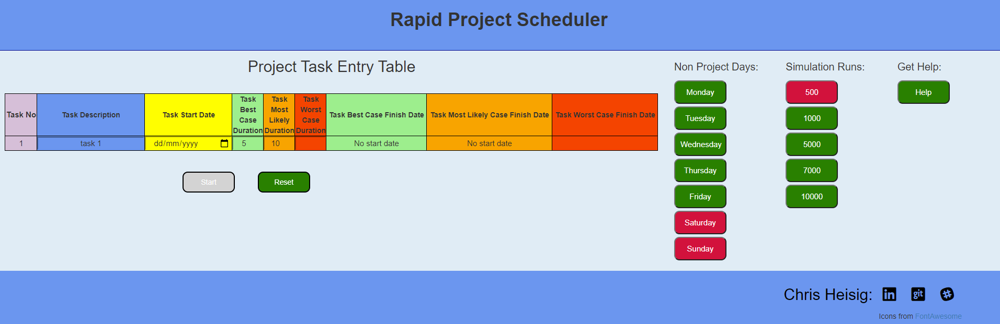
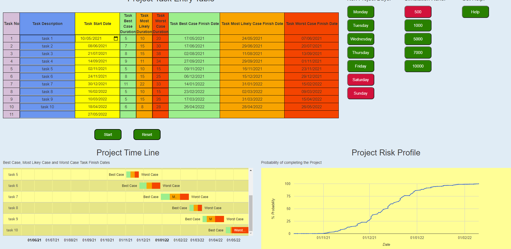

# Milestone 2 Project -Testing

## 5.1 Javascript code shall pass validation checks using JShint with no errors.

- **Test Method**

  Cut and paste the JavaScript code into the JShint online validator. Ensure that the JQuery and ES6 options are selected in the configuration and run.

- **Expected Outcome**

  No errors reported.

- **Tested Outcome**

  {width=80%}

  "google" was identified as an unknown variable. Further internet searches revealed this to be a known issue.

## 5.2 HTML code shall pass validation checks using W3C with no errors.

- **Test Method**

  Cut and paste the HTML code into the W3C validator and run the validation checks.

- **Expected Outcome**

  No error reported.

- **Test Outcome**

  No errors identified.
  {width=80%}

## 5.3 CSS shall pass validation checks using W3C with no errors

- **Test Method**

   Cut and paste the HTML code into the W3C validator and run the validation checks.

- **Expected Outcome**

  No error reported.

- **Test Outcome**

  No errors reported
  {width=80%}

## 5.4 The web page shall render identically in Chrome, IE and Firefox browsers. 

- **Test Method**

For each browser (Chrome, IE and Firefox) load the Index HTML page.

1. Make the following entries into the task entry table:

   | Task Description       | Task Start Date  | Best Case | Most Likely| Worst Case |
   | -----------| -----------------| ------------ | -----------|----|
   | task 1| today's Date  | 5 | 10 | 15 |
   | task 2 | task 1 WC Date  | 8 | 16 | 32 |
   | | | | |

2. Click the **Submit** button

3. Check that the page renders identically in each in each browser.

- **Expected Outcome**

  With minor cosmetics differences, each of the three browsers renders the page identically.

- **Test Outcome**

  {width=60%}
  *fig Browser Internet Explorer*

  {width=60%}
  *fig Browser Firefox*

  Difficult to capture an appropriate image in Firefox that does not need to be scrolled. 

  {width=60%}
  *fig Browser Chrome*

Note that since testing some titles have been changed to provide greater clarity.

## 5.5 The web page must be readable at screen widths of 1206px 768px and 320px.

   {width=60%}

   {width=60%}

   {width=60%}

Note that:

- Google charts expand or contract to fit their container, therefore the start button must be clicked to ensure that the charts are displayed at their optimum size.

- Since testing some titles have been changed to provide greater clarity.

## 2.1.1.1 This project and risk planning tool will require only one web page

## 2.1.1.2 A task entry table is required for the entry of project task best case, most likely case and worst case durations and a project start date

## 2.1.1.3 Saturdays and Sundays are required as the default non project days

## 2.1.1.4 A project timeline plot is required to provide a visual representation of the task data entered

## 2.1.1.5 A plot is required to provide the risk profile assoaciated with completing the project at a given date

- **Test Method**

1. Navigate to the index file and open in the Chrome browser.

2. Confirm that only one page is availble.

3. Confirm that a **Task Entry Table** is displayed in the form:

    | Task No.| Task Description       | Task Start Date  | Best Case | Most Likely| Worst Case | Best Case Completion Date | Most Likely Case Completion Date | Worst Case Completion Date |
   | ----| ---| --- | ---|----|---|---|---|---|

4. Make the following entries into the task entry table:

   | Task Description       | Task Start Date  | Best Case | Most Likely| Worst Case |
   | -----------| -----------------| ------------ | -----------|----|
   | task 1| today's Date  | 5 | 10 | 15 |
   | task 2 | task 1 WC Date  | 8 | 16 | 32 |
   | | | | |

2. Click the **Submit** button.

3. Check that the page renders identically in each in each browser.

- **Expected Outcome**

1. The **Task Entry Table** is displayed.

2. The **Non Project Day** buttons for Saturday and Sunday have a red background and Monday to Friday have a green background

3. The tasks identified in step 4 may be entered.

4. The **Start Button** may be clicked.

5. A **Timeline Plot** and **Project Profile Plot** are rendered.

6. Hover over the **Worst Case** bar of the task 2 and confirm that the date matches that in the **Task Entry Table**.

7. Hover over the **Project Profile Plot** and confirm that the date assocaited with the final data point is on or before the **Worst Case** date of task 2 in the **Task Entry Table** 

- **Test Outcome**

  {width=60%}

   *fig:Screenshot prior to task entry.*

  {width=60%} 

  *fig:Sceenshot after simulation run with risk profile date.*

  {width=60%} 

  *fig:Sceenshot after simulation run with project completion date.*

## 2.1.2.1 The user will be provided with positive feedback when hovering above an avaialble button

## 2.1.2.2 Buttons that cannot be used will be greyed out until such time as they can be used

## 2.1.2.3 The project timeline plot and project risk profile plot will only be displayed when there is sufficient task data to create them.

## 2.1.2.4 An alert will be displayed when an error is detected in the task entry table

## 2.1.2.5 An alert will be displayed when every day of the week is selected as a non working week *****************

## 2.1.2.6 The timeline plot and project profile plot will not be generated or updated if an error is detected in the task entry table

- **Test Method**

1. Navigate to the index file and open in the Chrome browser.

2. Hover over each button and confirm that when the mouse enters the button if the button is either red or green it highlights and lowlights when the mouse leaves the button.

3. Confirm that for the greyed out **Start** button there is no action.

4. Click on the greyed out **Start** button and confirm that there is no action.

5. Enter the following tasks:

 | Task Description       | Task Start Date  | Best Case | Most Likely| Worst Case |
   | -----------| -----------------| ------------ | -----------|----|
   | task 1| today's Date  | 5 | 10 | 15 |

6. Confirm that the **Start** button now becomes green.

7. Confirm that the **Project Timeline Plot** and the **Project Risk Profile Plot** are displayed. 

8. Enter the following task addiional task omitting the task description:

 | Task Description       | Task Start Date  | Best Case | Most Likely| Worst Case |
   | -----------| -----------------| ------------ | -----------|----|
   |  | task 1 WC Date  | 8 | 16 | 32 |

9. Confirm that an **Alert** window is displayed and that it contains a alert message.

10. Close the **Alert** window

11. Click on the **Start** button and confirm that the **Project Timeline Plot** and the **Project Risk Profile Plot** are not updated.

12. Now enter the task description for the second task "task 2".

13. Click on the **Start** button and confirm that the **Project Timeline Plot** and the **Project Risk Profile Plot** are updated.

- **Expected Outcome**

- 1. Hovering on any button with a green or red button highlights and then low lights the button.

- 2. The greyed out **Start** button remains inactive.

- 3. After entering the first task the **Start** button becomes green

- 4. After clicking the **Start** button, the **Project Timeline Plot** and the **Project Risk Profile Plot** are displayed

- 5. The **Project Timeline Plot** and the **Project Risk Profile Plot** are not updated with task entries that include an error.

- 6. Once the error has been updated and the **Start** button clicked the  **Project Timeline Plot** and the **Project Risk Profile Plot** are updated

- **Test Outcome**

The Expected outcomes are confirmed.

 {width=60%} 
  *fig:Tasks with errors are not included in the Project Timeline and Project Risk Profile Plots*

 {width=60%} 
  *fig:Tasks with errors corrected are included in the Project Timeline and Project Risk Profile Plots*

## 2.1.3.1 A new table row will be made available without the need to actively confirm the current row

## 2.1.3.2 A new task row will not become available until the task data in the present row has been correctly entered

## 2.1.3.3 Task data may be entered in any order

## 2.1.3.4 Error check of a new task entry row will be undertaken after the worst case task duration has been entered

## 2.1.3.5 There will be no restriction on the number of tasks that may be entered

- **Test Method**

1. Navigate to the index file and open in the Chrome browser.

2. Enter task data in the following order **Best Case Duration** = 5, **Most Likely Case Duration** = 15, **Task Description** = task 1 and **Start Date** = todays date and **Worst Case Duration** = 20

3. Confirm that task data may be entered in this non intuative sequence and that a second task row is provided.

4. In the second task row enter a **Worst Case Duration** of 30

5. Confirm that an **Alert** is displayed.

6. Enter the following tasks. Note that while the requirement is for any number of tasks to be permitted, for test purposes only 20 will be entered. 

   |Task Description|Start Date |Best Case Duration |Most Likely Case Duration |Worst Case Duration|
   |----------------|---------- |------------------ |------------------------- |-------------------|
     |task 1 |10/05/21   |5  |10 |15 |
    |task 2 | | 7 | 15 | 30 |
      |task 3 | | 8 | 15 | 38 |
    |task 4 | | 9 | 11 | 13 |
    |task 5 | | 12  | 24   | 36   |
    |task 6 | |  8 | 15   | 25   |
    | task 7 | | 11  | 22   | 33    |
    |task 8  | |  5  | 10   | 15    |
    | task 9 |  |  5   | 15   | 26   |
    | task 10 |  |  6   | 8    | 24   |

7. Click **Start** and confirm that the plots are generated.

8. Change the **Start Date** of task 1 to the 04/02/2021

9. Confirm that the **Worst Case Completion Date** of task 10 has changed from 26/05/2022 to the to ?????

10. Enter the following additional tasks:

    |Task Description|Start Date |Best Case Duration |Most Likely Case Duration |Worst Case Duration|
    |----------------|---------- |------------------ |------------------------- |-------------------|
    |task 11 | |9  |15 |22 |
    |task 12 | | 7 | 18 | 19 |
    |task 13 | | 11 | 22 | 33 |
    |task 14 | | 9 | 11 | 13 |
    |task 15 | | 5  | 8   | 10   |
    |task 16 | |  2 | 3   | 4   |
    |task 17 | | 2 | 5   | 6    |
    |task 18 | | 5 | 6   | 7    |
    |task 19 | | 3 | 6   | 11   |
    |task 20 | | 5 | 10  | 15   |

11. Confirm a **Worst Case Completion Date** of 20/09/2022.

- **Expected Outcome**

1. Task data may be entered in any order but the new task entry row does not appear until the **Worst Case Duration** is entered.

2. With just the **Worst Case Duration** entered, an **Alert** is displayed.

- **Test Outcome**

1. Confirmed that task data may be entered in any order.

2. Confirmed that with just the **Worst Case Duration** entered, an **Alert** is displayed

   {width=60%} 
  *fig:Worst case duration required to trigger task entry calidation*

3. Confirmed 10 tasks entered and plots generated.

   {width=60%} 
  *fig:10 tasks entered with present day as the start date*

4. Project completion date 

   {width=60%} 
  *fig:10 task entered with a past day as the start day*

   {width=60%} 
  *fig:20 taskw entered with a past day as the start day*

## 5.1.1 There should be no limit to the number of tasks that can be added to the task entry table

- **Test Method**

   Due to the volume of task data to be entered, requirements 5.1.1, 5.1.2, 5.1.3 and 5.1.4 are tested in one test run.

   A maximum of 20 tasks are entered during this test. This is considerably more than a user would want to enter.

   Step 1: Load the web page and confirm that it renders as shown below:

   Step 2: Enter the task data in the table below:

   |Task Description|Start Date |Best Case Duration |Most Likely Case Duration |Worst Case Duration|
   |----------------|---------- |------------------ |------------------------- |-------------------|
   |task 1          |10/05/21   |5                  |10                        |15                 |

   Step 3:  Confirm that the 

## 8.1 Instructions on how to use the this web tool must be available on request.

## 8.2 Help on interpreting the charts must be available on request.

- **Test Method**

  Step 1. Bring up the web page in a browser

  Step 2. Click on the help button and confirm that the window displays instructions on how to use the web tool and how to interpret the charts that are produced.

  Step 3. Click on the close button inside the Help window. Confirm that the Help window closes.

  Step 4. Enter the task data in the table below:

  |Task Description|Start Date |Best Case Duration |Most Likely Case Duration |Worst Case Duration|
  |----------------|---------- |------------------ |------------------------- |-------------------|
  |task 1          |10/05/21   |5                  |10                        |15                 |

  Step 5. Click the start button

  Step 6. Confirm that the Help window is displayed

  Step 7. click on the close button inside the Help window. Confirm that the Help window closes.

- **Expected Outcome**

  All Test Method steps may be followed to completion.

- **Test Outcome**

  Test steps confirmed. The image below shows the Help window displayed together with the charts. Note that it is not possible to use the web page while the help widow is displayed. This may be a defect or an oportunity for a future enhancement.

  {width=60%}

## 8.3 Errors in the entry of task data will be reported such that task data can be entered in any order.

## 8.4 A new table row will be made available without the need to actively confirm the current row.

## 8.5 A new task table row will not be made available unless the data entered in the current line is correct.