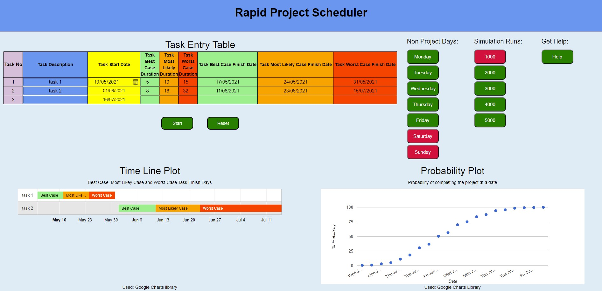
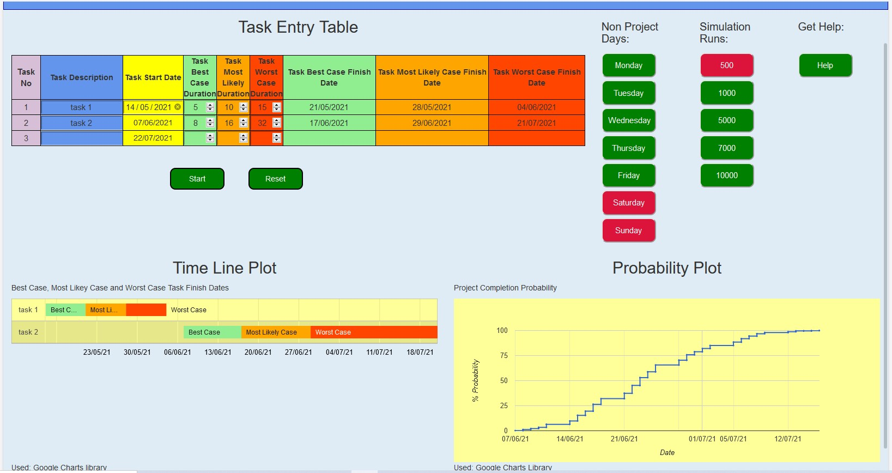
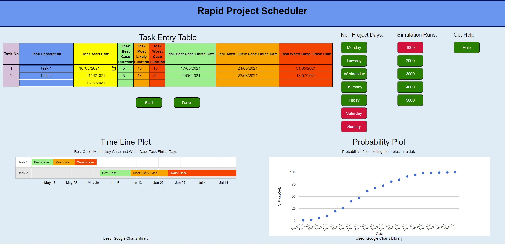

## 1.1 Javascript code shall pass validation checks using JShint with no errors.

**Test Method**

Cut and paste the JavaScript code into the JShint online validator. Ensure that the JQuery and ES6 options are selected in the configuration and run.

**Expected Outcome**

No errors reported.

**Tested Outcome**

"google" was identified as an unknown variable. Further internet searches revealed this to be a known issue.

## 1.2 HTML code shall pass validation checks using W3C with no errors.

**Test Method**

Cut and paste the HTML code into the W3C validator and run the validation checks.

**Expected Outcome**

No error reported.

**Test Outcome**

No errors reported

## 1.3 CSS shall pass validation checks using W3C with no errors

**Test Method**

Cut and paste the HTML code into the W3C validator and run the validation checks.

**Expected Outcome**

No error reported.

**Test Outcome**

No errors reported

## 1.4 The web page shall render identically in Chrome, IE and Firefox browsers. 
 
**Test Method**

For each browser (Chrome, IE and Firefox) load the Index HTML page.

1. Make the following entries into the task entry table:

| Task Description       | Task Start Date  | Best Case | Most Likely| Worst Case |
| -----------| -----------------| ------------ | -----------|----|
| task 1| today's Date  | 5 | 10 | 15 |
| task 2 | task 1 WC Date  | 8 | 16 | 32 |
| | | | |

1. Click the **Submit** button
2. Check that the page renders identically in each in each browser. 

**Expected Outcome**

With minor cosmetics differences, each of the three browsers renders the page identically.

**Test Outcome**

{width=60%}

*fig Browser Internet Explorer*

{width=60%}

*fig Browser Firefox*

{width=60%}

*fig Browser Chrome*

