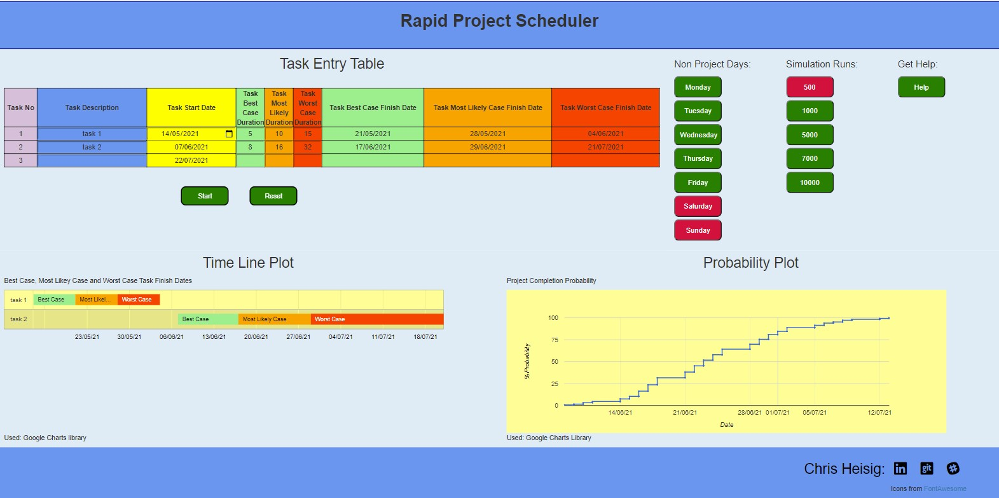
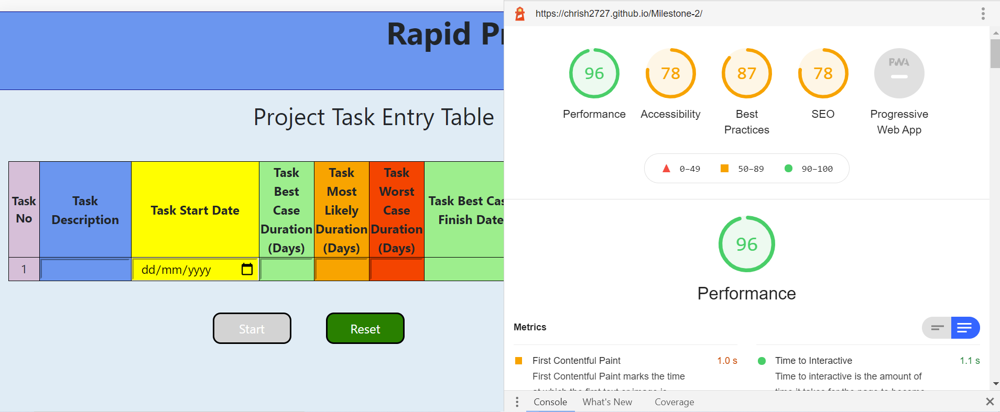
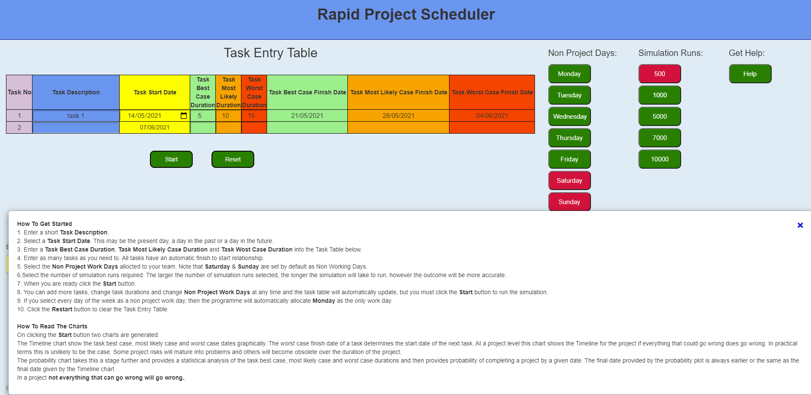
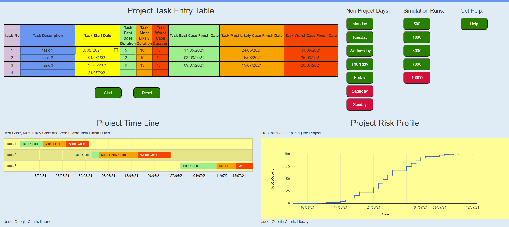
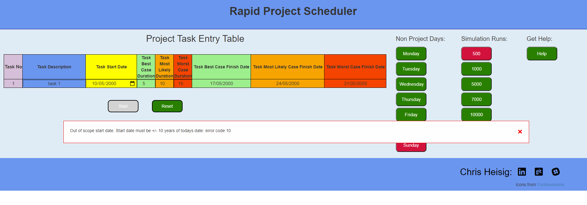

# Milestone 2 Project -Testing

[[toc]]

### Non Functional Testing

Each non functional requirement to be tested is referenced back to the README document.

#### 5.1 Javascript code shall pass validation checks using JShint with no errors

- **Test Method**

  Cut and paste the JavaScript code into the JShint online validator. Ensure that the JQuery and ES6 options are selected in the configuration and run.

- **Expected Outcome**

  No errors reported.

- **Tested Outcome**

  {width=80%}

  "google" was identified as an unknown variable. Further internet searches revealed this to be a known issue.

#### 5.2 HTML code shall pass validation checks using W3C with no errors.

- **Test Method**

  Cut and paste the HTML code into the W3C validator and run the validation checks.

- **Expected Outcome**

  No error reported.

- **Test Outcome**

  No errors identified.

  {width=80%}

#### 5.3 CSS shall pass validation checks using W3C with no errors

- **Test Method**

   Cut and paste the HTML code into the W3C validator and run the validation checks.

- **Expected Outcome**

  No error reported.

- **Test Outcome**

  No errors reported

  {width=80%}

#### 5.4 The web page shall render identically in Chrome, IE and Firefox browsers

- **Test Method**

  For each browser (Chrome, IE and Firefox) load the Index HTML page.

  Step 1. Make the following entries into the task entry table:

  | Task Description       | Task Start Date  | Best Case | Most Likely| Worst Case |
  | -----------| -----------------| ------------ | -----------|----|
  | task 1| today's Date  | 5 | 10 | 15 |
  | task 2 | task 1 WC Date  | 8 | 16 | 32 |
  | | | | |

  Step 2. Click the **Submit** button

  Step 3. Check that the page renders identically in each in each browser.

- **Expected Outcome**

  With minor cosmetics differences, each of the three browsers renders the page identically.

- **Test Outcome**

  {width=60%}
  *fig Browser Internet Explorer*

  {width=60%}
  *fig Browser Firefox*

  Difficult to capture an appropriate image in Firefox that does not need to be scrolled. 

  {width=60%}
  *fig Browser Chrome*

Note that since testing the "Time Line Plot" title has changed to "Project Time Line" and "Probability Plot" has changed to "Project Risk Profile" to provide greater clarity.

#### 5.5 The web page must be readable at screen widths of 1206px 768px and 320px

  {width=60%}

  {width=60%}

  {width=60%}

Note that:

- Google charts expand or contract to fit their container, therefore the start button must be clicked to ensure that the charts are displayed at their optimum size.

- Since testing the plot titles have been changed to provide greater clarity. **Timeline Plot** is now titled **Project Timeline** and **Probability Plot** is now titled **Project Risk Profile**.

- Since preparing the wireframes described above a footer has been introduced to the page showing the authors contact details. The screenshots throughout the remainder of this document will depict the footer.

- While the page is readable at smaller screen width and display information correctly, it may not be scalled correctlly.

#### 5.6 Google Lighthouse Report

{width=60%}

Google Lighthouse was run to analyse the web page. Results indicate that while performance is good, there are clearly some issues to address.

### Functional Testing

Each requirement to be tested is referenced back to the user strory found in the README from which it originated.

#### 2.1.1.1 This project and risk planning tool will require only one web browser page to render

#### 2.1.1.2 A task entry table is required for the entry of project task best case, most likely case and worst case durations and a project start date

#### 2.1.1.3 Saturdays and Sundays are required as the default non project days

#### 2.1.1.4 The number of required simulation runs will be set to 500 on initialisation

#### 2.1.1.5 A project timeline plot is required to provide a visual representation of the task data entered

#### 2.1.1.6 A plot is required to provide the risk profile associated with completing the project at a given date

- **Test Method**

  Step 1. Navigate to the index file and open in the Chrome browser.

  Step 2. Confirm that only one page is available.

  Step 3. Confirm that Saturday and Sunday non project day buttons have a red background.

  Step 4. Confirm that the button selecting 500 simulation runs has a red background

  Step 5. Confirm that a **Task Entry Table** is displayed in the form:

  | Task No.| Task Description       | Task Start Date  | Best Case | Most Likely| Worst Case | Best Case Completion Date | Most Likely Case Completion Date | Worst Case Completion Date |
  | ----| ---| --- | ---|----|---|---|---|---|

  Step 6. Make the following entries into the task entry table:

   | Task Description       | Task Start Date  | Best Case | Most Likely| Worst Case |
   | -----------| -----------------| ------------ | -----------|----|
   | task 1| today's Date  | 5 | 10 | 15 |
   | task 2 | task 1 WC Date  | 8 | 16 | 32 |
   | | | | |

  Step 7. Click the **Submit** button.

  Step 8. Confirm that **Timeline Plot** is generated and displayed

  Step 9. Confirm that a **Project Profile Plot** is generated and displayed

- **Expected Outcome**

1. The **Task Entry Table** is displayed.

2. The **Non Project Day** buttons for Saturday and Sunday have a red background and Monday to Friday have a green background

3. The tasks identified in step 6 may be entered.

4. The 500 **Simulation Runs** button has a red background.

5. The **Start Button** may be clicked.

5. A **Timeline Plot** and **Project Profile Plot** are rendered.

6. Hover over the **Worst Case** bar of the task 2 and confirm that the date matches that in the **Task Entry Table**.

7. Hover over the **Project Profile Plot** and confirm that the date assocaited with the final data point is on or before the **Worst Case** date of task 2 in the **Task Entry Table**.

- **Test Outcome**

  All expected outcomes confirmed.

  {width=60%}

  *fig:Screenshot above prior to task entry.*

  {width=60%} 

  *fig:Sceenshot after simulation run with risk profile date.*

  {width=60%} 

  *fig:Sceenshot above after simulation run with project completion date.*

#### 2.1.2.1 The user will be provided with positive feedback when hovering above an available button

#### 2.1.2.2 Buttons that cannot be used will be greyed out until such time as they can be used.

#### 2.1.2.3 The timeline plot and risk profile plot will only be displayed when there is sufficient task data to create them.

#### 2.1.2.4 An alert will be displayed when an error is detected in the task entry table

#### 2.1.2.5 The timeline plot and project risk profile plot will not be generated or updated if an error is detected in the task entry table

#### 2.1.2.6 A new task row will be made available without the need to actively confirm the current row

#### 2.1.2.7 A new task row will not become available until the task data in the present row has been correctly entered.

#### 2.1.2.8 Task data may be entered in any order.

#### 2.1.2.9 Error check of a new task entry row will be undertaken after the worst case task duration has been entered

- **Test Method**

  Step 1. Navigate to the index file and open in the Chrome browser.

  Step 2. Hover over each button and confirm that when the mouse enters the button if the button is either red or green it highlights and lowlights when the mouse leaves the button.

  Step 3. Confirm that for the greyed out **Start** button there is no action.

  Step 4. Click on the greyed out **Start** button and confirm that there is no action.

  Step 5. Enter the following tasks:

  | Task Description       | Task Start Date  | Best Case | Most Likely| Worst Case |
   | -----------| -----------------| ------------ | -----------|----|
   | task 1| today's Date  | 5 | 10 | 15 |

  Step 6. Confirm that the **Start** button now becomes green.

  Step 7. Confirm that the **Project Timeline Plot** and the **Project Risk Profile Plot** are displayed. 

  Step 8. Enter the following task addiional task omitting the task description:

  | Task Description       | Task Start Date  | Best Case | Most Likely| Worst Case |
   | -----------| -----------------| ------------ | -----------|----|
   |  | task 1 WC Date  | 8 | 16 | 32 |

  Step 9. Confirm that an **Alert** window is displayed and that it contains a alert message.

  Step 10. Close the **Alert** window

  Step 11. Click on the **Start** button and confirm that the **Project Timeline Plot** and the **Project Risk Profile Plot** are not updated.

  Step 12. Now enter the task description for the second task "task 2".

  Step 13. Click on the **Start** button and confirm that the **Project Timeline Plot** and the **Project Risk Profile Plot** are updated.

- **Expected Outcome**

1. Hovering on any button with a green or red button highlights and then low lights the button.

2. The greyed out **Start** button remains inactive.

3. After entering the first task the **Start** button becomes green

4. After clicking the **Start** button, the **Project Timeline Plot** and the **Project Risk Profile Plot** are displayed

5. The **Project Timeline Plot** and the **Project Risk Profile Plot** are not updated with task entries that include an error.

6. Once the error has been updated and the **Start** button clicked the  **Project Timeline Plot** and the **Project Risk Profile Plot** are updated

- **Test Outcome**

The Expected outcomes are confirmed.

 {width=60%} 
  *fig:Tasks with errors are not included in the Project Timeline and Project Risk Profile Plots*

 {width=60%} 
  *fig:Tasks with errors corrected are included in the Project Timeline and Project Risk Profile Plots*

#### 2.1.2.10 There will be no restriction on the number of tasks that may be entered

-**Test Method**

  Step 1. Navigate to the index file and open in the Chrome browser.

  Step 2. Enter the following tasks. Note that while the requirement is for any number of tasks to be permitted, for test purposes only 20 will be entered. 

  |Task Description|Start Date |Best Case Duration |Most Likely Case Duration |Worst Case Duration|
  |----------------|---------- |------------------ |------------------------- |-------------------|
  |task 1 |10/05/21   |5  |10 |15 |
  |task 2 | | 7 | 15 | 30 |
  |task 3 | | 8 | 15 | 38 |
  |task 4 | | 9 | 11 | 13 |
  |task 5 | | 12  | 24   | 36   |
  |task 6 | |  8 | 15   | 25   |
  | task 7 | | 11  | 22   | 33    |
  |task 8  | |  5  | 10   | 15    |
  | task 9 |  |  5   | 15   | 26   |
  | task 10 |  |  6   | 8    | 24   |

  Step 3. Click **Start** and confirm that the plots are generated.

  Step 4. Enter the following additional tasks:

  |Task Description|Start Date |Best Case Duration |Most Likely Case Duration |Worst Case Duration|
  |----------------|---------- |------------------ |------------------------- |-------------------|
  |task 11 | |9  |15 |22 |
  |task 12 | | 7 | 18 | 19 |
  |task 13 | | 11 | 22 | 33 |
  |task 14 | | 9 | 11 | 13 |
  |task 15 | | 5  | 8   | 10   |
  |task 16 | |  2 | 3   | 4   |
  |task 17 | | 2 | 5   | 6    |
  |task 18 | | 5 | 6   | 7    |
  |task 19 | | 3 | 6   | 11   |
  |task 20 | | 5 | 10  | 15   |

  Step 5. Confirm a **Worst Case Completion Date** of 20/09/2022.

- **Expected Outcome**

1. 20 tasks may be entered into the task table and plots produced.

- **Test Outcome**

3. Confirmed 10 tasks entered and plots generated.

   {width=60%} 
  *fig:10 tasks entered and plots generated*

4. Project completion date

   {width=60%} 
  *fig:20 tasks entered and plots generated*

#### 2.1.3.1 The Best Case, Most Likely Case and Worst Case task finish dates will be determined using the start date and the week days allocated to the project

#### 2.1.3.2 The initial project start date may be set to a past date, the present date or a future date

-**Test Method**

  Step1. Navigate to the index file and open in the Chrome browser.

  Step 2. Enter the task data in the table below:

  |Task Description|Start Date |Best Case Duration |Most Likely Case Duration |Worst Case Duration|
  |----|----- |--- |---- |-------|
  |task 1|10/05/21 |5 |10 |15|
  |task 2| |2 |10|18|
  |task 3|| 9| 13 |16|

   Step 3 Click the **Start** button

   Step 4 Confirm that the start dates assocaited with task 2 and task 3 are as shown below

  |Task Description|Start Date |Best Case Duration |Most Likely Case Duration |Worst Case Duration|
  |----|----- |--- |---- |-------|
  |task 1|10/05/21 |5 |10 |15|
  |task 2|26/05/21 |2 |10|18|
  |task 3|14/06/21| 9| 13 |16|

   Step 5 Change only the start date of task 1 to 10/06/21

   Step 6 Confirm that the start dates assocaited with task 2 and task 3 are as shown below

  |Task Description|Start Date |Best Case Duration |Most Likely Case Duration |Worst Case Duration|
  |----|----- |--- |---- |-------|
  |task 1|10/06/21 |5 |10 |15|
  |task 2|02/07/21 |2 |10|18|
  |task 3|29/07/21| 9| 13 |16|

   Step 7 Change only the start date of task 1 to 10/04/21

   Step 8 Confirm that the start dates assocaited with task 2 and task 3 are as shown below

  |Task Description|Start Date |Best Case Duration |Most Likely Case Duration |Worst Case Duration|
  |----|----- |--- |---- |-------|
  |task 1|10/04/21 |5 |10 |15|
  |task 2|03/05/21 |2 |10|18|
  |task 3|28/05/21| 9| 13 |16|

- **Expected Outcome**

  The start dates for for tasks 2 and 3 shift forward by one month in the case of step 6 and one month backward in the case of step 8.

- **Test Outcome**

  {width=60%}
  *fig:Start date of task 1 set to the 10/05/21*

  {width=60%}
  *fig:Start date of task 1 set to the 10/06/21*

  {width=60%}
  *fig:Start date of task 1 set to the 10/04/21*

#### 2.1.4.1 The tasks in the task entry table may be changed after an initial timeline plot and risk profile plot have been generated

#### 2.1.4.2 Tasks may be added to the task entry table after an initial timeline plot and risk profile plot have been generated

- **Test Outcome**

  Tested as part of requirement 2.1.2.10

#### 2.1.5.1 The tasks completion dates associated with the best case, most likely case and worst task durations will be re calculated when ever the non project days is changed.  

- **Test Outcome**

   Tested as part of requirement 2.1.7.1

#### 2.1.6.1 The timeline plot will display a single bar for each task showing the best case, most likely case and worst case task completion date

#### 2.1.6.2 The timeline plot is updated whenever the start button is clicked and will display any changes made to the task entry table or the non project days selected

- **Test Method**

  Step 1 Bring up the web page in a browser.
  
  Step 2. Enter the task data in the table below:

  |Task Description|Start Date |Best Case Duration |Most Likely Case Duration |Worst Case Duration|
  |----------------|---------- |------------------ |------------------------- |-------------------|
  | task 1|10/05/21 |5  |10  |15|
  | task 2|26/05/21 |    2    |  10  |  18 |
  |task 3 |14/06/21| 9| 13 |16|

   Step 3 Click the **Start** button
   
   Step 4 Confirm that task 1, task 2 and task 3 are displayed in the timeline plot.

   Step 5 Hover over the Best Case, Most Likely Case and  Worst Case finish dates for each task in the plot and confirm that it matches the the Best Case Date, Most Likely Case date and Worst Case date in the task table.  

   Step 6 Click to select another non project day and repeat Steps 4 and 5

   Step 7 Confirm that the task entry table dates change with the selection of an additional non project day.

   Step 8 Confirm that the project timeline plot is updated. 

- **Expected Outcome**

   Steps 4, 7 and 8 are confirmed.  

- **Test Outcome**

   Steps 4,7, and 8 confirmed.

  {width=60%}
   *fig at the start of the test*

  {width=60%}
   *fig at the finish of the test*
  
  Note the change in the project dates and the timeline plot.

#### 2.1.7.1 The risk profile plot will update when ever the start button is clicked and will respond to changes made to the task entry table, the non project days selected and the number of simulation runs selected

- **Test Method**

  Step 1. Bring up the web page in a browser

  Step 2. Click on Saturday and Sunday to make them both project days

  Step 2. Enter the task data in the table below:

  |Task Description|Start Date |Best Case Duration |Most Likely Case Duration |Worst Case Duration|
  |----------------|---------- |------------------ |------------------------- |-------------------|
  | task 1|10/05/21 |5  |10  |15|
  | task 2|26/05/21 |    2    |  10  |  18 |
  |task 3 |14/06/21| 9| 13 |16|

  Step 3. Record the task 2 and task 3 start dates after sucessively selecting the following non project days. Click the **Start** button to updated the Project Timeline plot and the Risk Profile plot.

  |Non Project Days|task 2 start date |task 3 start date  |
  |----------------|---------- |------------------ |
  |none  |   |   |
  |Sun   |  |  |
  |Sun, Sat|  |   |
  |Sun, Sat, Fri |   |   |
  |Sun, Sat, Fri, Thur |   |    |
  |Sun, Sat, Fri, Thur, Wed|   |   |
  |Sun, Sat, Fri, Thur, Wed, Tue| | |
  |Mon |  |  |

  Note that while Monday can be selected as a non project day, Monday - Sunday results in an error alert.

- **Expected Outcome**

  The following dates should be displayed as the task 2 and task 3 start dates.

  |Non Project Days|task 2 start date |task 3 start date  |
  |----------------|---------- |------------------ |
  |none  | 26/05/21  | 14/06/21  |
  |Sun   | 28/05/21  | 19/06/21  |
  |Sun, Sat| 01/06/21 |28/06/21    |
  |Sun, Sat, Fri | 07/06/21  | 08/07/21  |
  |Sun, Sat, Fri, Thur | 15/06/21  | 28/07/21   |
  |Sun, Sat, Fri, Thur, Wed| 05/07/21  | 07/09/21  |
  |Sun, Sat, Fri, Thur, Wed, Tue|30/08/21 |10/01/22 |
  |Mon | 28/05/21 | 19/06/21 |

  The Project Timeline Plot and Risk Profile plot should reflect the above dates.

- **Test Outcome**

  The table of start dates is confirmed.

  The Project Timeline Plot and Risk Profile plot are reproduced.

  {width=60%}

  *fig (above) No non project days selected*

  {width=60%}

  *fig (above) Only one non project day selected*

#### 2.1.8.1 Help to enter task data will be available on request at any time

#### 2.1.8.2 Help to interpret charts will be available on request at any time

**Test Method**

  Step 1. Bring up the web page in a browser

  Step 2. Click on the help button and confirm that the window displays instructions on how to use the web tool and how to interpret the charts that are produced.

  Step 3. Click on the close button inside the Help window. Confirm that the Help window closes.

  Step 4. Enter the task data in the table below:

  |Task Description|Start Date |Best Case Duration |Most Likely Case Duration |Worst Case Duration|
  |----------------|---------- |------------------ |------------------------- |-------------------|
  |task 1          |10/05/21   |5                  |10                        |15                 |

  Step 5. Click the start button

  Step 6. Confirm that the Help window is displayed

  Step 7. click on the close button inside the Help window. Confirm that the Help window closes.

- **Expected Outcome**

  All Test Method steps may be followed to completion.

- **Test Outcome**

  Test steps confirmed. The image below shows the Help window displayed together with the charts. Note that it is not possible to use the web page while the help widow is displayed. This may be a defect or an oportunity for a future enhancement.

  {width=60%}

#### 2.1.9.1 The risk profile chart will respond to the number of simulation runs selected by the user

- **Test Method**

This requirement is difficult to test, however with an increase in the number of simulation runs, risk profile plot will become more stable.  

Step 1. Bring up the web page in a browser

Step 2. Enter the task data in the table below:

  |Task Description|Start Date |Best Case Duration |Most Likely Case Duration |Worst Case Duration|
  |----------------|---------- |------------------ |------------------------- |-------------------|
  | task 1|10/05/21 |5  |10  |15|
| task 2|01/06/21 |    2    |  10  |  18 |
|task 3 |28/06/21| 9| 13 |16|

  Step 3. Click the **Start** button several times.

  Step 4. Confirm the volatility in the project risk profile plot and final date when hovering above the final data point.

  Step 5. Select 1000 simulation runs. 

  Step 6. Repeat steps 3 and 4.

  Step 7. Select 5000 simulation runs.

  Step 8. Repeat steps 3 and 4.

  Step 9. Select 7000 simulation runs.

  Step 10 Repeat steps 3 and 4.

  Step 11 Select 10000 simulation runs.

  Step 12 Repeat steps 3 and 4 

- **Expected Outcome**

  As the number of simulation runs increases, the risk profile plot becomes more stable.

- **Test Outcome**

  Clicking the **Start** button several times comfirms that the final data point on the project risk profile remains the 13/07/2021 whereas with fewer simulation runs the final data point varies from the 08/07/2021 to the 13/07/2021.

  {width=60%}

#### 2.1.10.1 The user must enter a task description

- **Test Method**

  This test confirms the operation of the code for one error condition in a number of scenarios.

  Step 1. Bring up the web page in a browser

  Step 2. Enter the task data in the table below:

  |Task Description|Start Date |Best Case Duration |Most Likely Case Duration |Worst Case Duration|
  |----------------|---------- |------------------ |------------------------- |-------------------|
  |          |10/05/21   |5                  |10                        |15                 |

  Omit the task description!

  Step 3. confirm that the Alert box displays "You must include a unique task description: error code 4"

  Step 5. Close the alert box

  Step 6. Enter the task description as "task 1"

  Step 7. Click the **Start** button

  Step 8. Confirm that the plots are rendered.

  Step 9.  Enter the following task data

  |Task Description|Start Date |Best Case Duration |Most Likely Case Duration |Worst Case Duration|
   |----|--- |------ |---- |----|
   | task 1  |10/05/21   |5    |10  |15  |
   |           |  | 7|14|21|

  Step 10. Confirm that the Alert box displays "You must include a unique task description: error code 4"

  Step 11. Close the alert window and click the **Start** button.

  Step 12. Confirm that the plots are not updated.

  Step 13. enter "task 2" as the second task description

  Step 14. Click on the **Start** button

  Step 15. Confirm that the charts are now updated. 

  Step 16. Delete task description "task 2".

  Step 17.  Confirm that the Alert box displays "You must include a unique task description: error code 4"

  Step 18. Close the alert window.

  Step 19 Click the **Start** button

  Step 20. Confirm that the **Start** button is greyed out and unavailable

  Step 21. Enter task description "task 2"

  Step 22. Confirm that the **Start** button becomes available again

  Step 23 Click the **Start**button

  Step 24 Confirm that the Project Risk Profile is re-rendered.

- **Expected Outcome**

  Steps 8, 12, 15, 17, 22 and 24 are confirmed

- **Test Outcome**

  Steps 8,12, 15, 17, 22 and 24 are confirmed

  {width=60%}

  It is assumed that all remaining error conditions are handled in the same way, therefore for the remaining error checks, only one scenario will be tested. 

#### 2.1.10.2 The task description must start with an alphanumeric character Subsequent non alphanumeric characters are permitted

#### 2.1.10.3 Negative value task duration values are not permitted

#### 2.1.10.4 Task duration values must be whole days. Fractions of a project day are not permitted

#### 2.1.10.5 Task duration values must be greater than 1

#### 2.1.10.6 The following condition must be met:  Best Case Duration < Most Likely Case Duration < Worst Case Duration

#### 2.1.10.7 If every day of the week is selected as a non project day, then Monday will automatically become the only project day. The user will receive an error alert

#### 2.1.10.8 The start date for the first project task must be within +/-10 years of the present date

- **Test Method** 

  Step 1. Bring up the web page in a browser

  Step 2. Enter the task data in the table below:

  |Task Description|Start Date |Best Case Duration |Most Likely Case Duration |Worst Case Duration|
  |-----|--- |----- |------ |------|
  |     |10/05/21   |5    |10     |15  |

  Step 3. Enter <space> into the task description field

  Step 4. Confirm that the following alert is displayed "The task description must start with an alphanumeric character: error code 7"

  Step 5 Click the **Restart** button

  Step 6 Enter the task data in the table below:

  |Task Description|Start Date |Best Case Duration |Most Likely Case Duration |Worst Case Duration|
  |----|--- |--- |---- |-------|
  | task 1  |10/05/21   |5  | -1    |15      |
  
  Step 7  Confirm that the following alert is displayed "The task duration values must be positive numbers: error code 9"

  Step 8 Click the **Restart** button

  Step 9 Enter the task data in the table below:

  |Task Description|Start Date |Best Case Duration |Most Likely Case Duration |Worst Case Duration|
  |----------------|---------- |------------------ |------------------------- |-------------------|
  |     task 1     |10/05/21   |5.5                  | 10                        |15                 |
  
  Step 10  Confirm that the following alert is displayed "The task duration value must be an integer value. Task duration values will be rounded if value is irrational: error code 8"

  Step 11 Click the **Restart** button

  Step 12 Enter the task data in the table below:

  |Task Description|Start Date |Best Case Duration |Most Likely Case Duration |Worst Case Duration|
  |----------------|---------- |------------------ |------------------------- |-------------------|
  |     task 1     |10/05/21   |0.5                  | 10                        |15                 |
  
  Step 13  Confirm that the following alert is displayed "Best case, most likely case and worst case duration must be greater than 1 day: error code 5"

  Step 14 Click the **Restart** button

  Step 15 Enter the task data in the table below:

  |Task Description|Start Date |Best Case Duration |Most Likely Case Duration |Worst Case Duration|
  |----------------|---------- |------------------ |------------------------- |-------------------|
  |     task 1     |10/05/21   |5                  | 10                        |5                 |
  
  Step 16  Confirm that the following alert is displayed "Best case duration musts be less that most likely case duration and most likely case duration must be less than worst case duration : error code 2"

  Step 17 Click the **Restart** button

  Step 18 Enter the task data in the table below:

  |Task Description|Start Date |Best Case Duration |Most Likely Case Duration |Worst Case Duration|
  |----------------|---------- |------------------ |------------------------- |-------------------|
  |     task 1     |10/05/21   |5                  | 10                        |15                 |
  
  Step 19  Select every day of the week as a non project day.

  Step 20 Confirm that it is not possible to make Monday a non project day

  Step 21 Confirm that the following alert is displayed "You must include at least 1 working day: error code 3".

  Step 22 Click the **Restart** button

  Step 23 Enter the task data in the table below:

  |Task Description|Start Date |Best Case Duration |Most Likely Case Duration |Worst Case Duration|
  |----------------|---------- |------------------ |------------------------- |-------------------|
  |     task 1     |10/05/2000   |5                  | 10                        |15                 |
  
  Step 24  Confirm that the following alert is displayed "Out of scope start date. Start date must be +/- 10 years of todays date: error code 10".

  Step 25 replace the start date with 10/05/2050

  Step 26 Confirm that the following alert is displayed "Out of scope start date. Start date must be +/- 10 years of todays date: error code 10".

- **Expected Outcome**

  Steps 4, 7, 10, 13, 16, 20, 21, 24 and 26 are confirmed. 

- **Tested Outcome**

  Step 4 Confirmed - error code 7 alerted when the task description starts with a non alphanumeric character.

  {width=60%}

  Step 7 Confirmed - error code 9 alerted when the task duration value is not a positive number.

  {width=60%}

  Step 10 Confirmed - error code 8 alerted when the task duration value is not an integer number.

  {width=60%}

  Step 13 Confirmed - error code 5 alerted when "Best case, most likely case and worst case duration are less than 1 day

  {width=60%}

  Step 16 Confirmed - error code 2 alerted when Best case duration musts be greater than most likely case duration and most likely case duration must be greater than worst case duration : error code 2"

  {width=60%}

  Steps 20 and 21 Confirmed - error code 3 alerted when an attempt is made to declare days of the week non project days.

  {width=60%}

  Steps 21 Confirmed - error code 10 alerted when the start date is greater than +/- 10 years of the present date.

  {width=60%}
